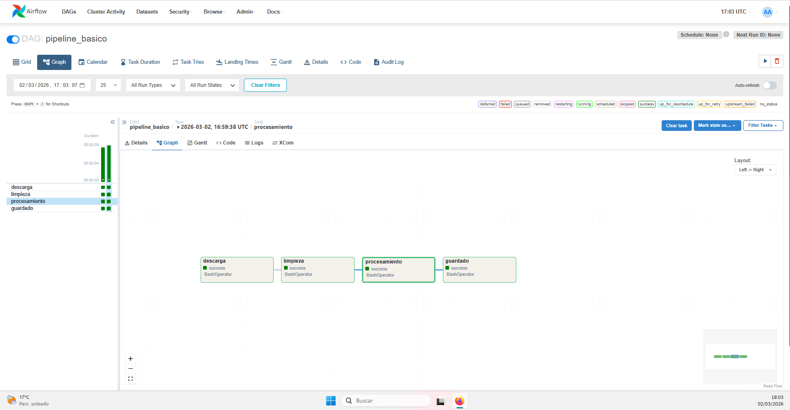
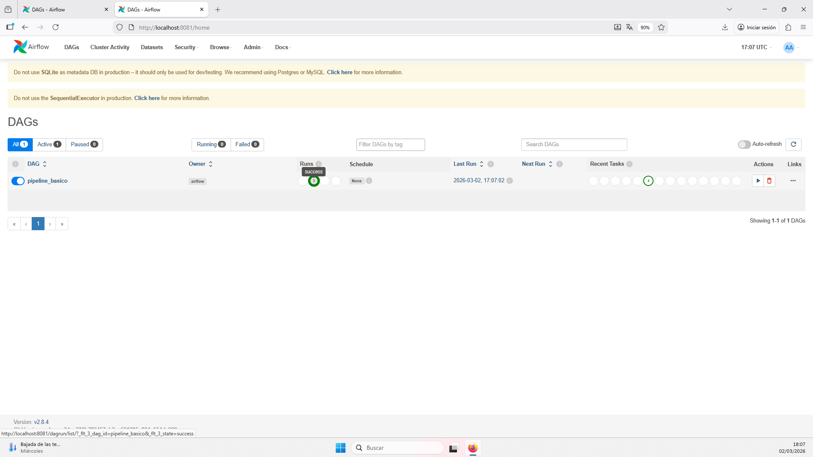
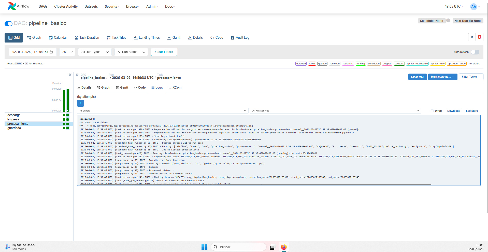

# UD4 - Laboratorio
## Documento de entrega - Orquestación básica con Airflow

---

## Datos del grupo

- Módulo: Sistemas de Big Data
- Unidad: UD4 - BI y Orquestación
- Curso: 2025-2026
- Grupo: BI-UD4-Airflow
- Integrantes: Juan Manuel Vega
- Fecha de entrega: 02/03/2026

---

# 1. Descripción del pipeline

## 1.1 Objetivo del flujo

Explicar brevemente:

- Qué representa el pipeline: un flujo ETL básico orquestado con Airflow para ejecutar tareas en orden y monitorizar su estado.
- Qué hace cada fase: `descarga` simula adquisición de datos, `limpieza` prepara el dato, `procesamiento` aplica transformación y `guardado` simula persistencia del resultado.
- Cuál es la lógica general: ejecutar las cuatro tareas de forma secuencial para garantizar que cada fase solo se inicia cuando la anterior finaliza correctamente.

---

## 1.2 Estructura del DAG

Adjuntar captura del DAG desde la interfaz de Airflow.

Describir:

- Número de tareas: 4 tareas.
- Orden de ejecución: `descarga -> limpieza -> procesamiento -> guardado`.
- Dependencias establecidas: dependencia lineal definida mediante `descarga >> limpieza >> procesamiento >> guardado`.

---

# 2. Descripción técnica

## 2.1 Tareas definidas

Para cada tarea indicar:

- Nombre de la tarea.
- Script ejecutado.
- Función dentro del pipeline.

1. `descarga` → script `scripts/descarga.py` → simula la fase de entrada de datos.
2. `limpieza` → script `scripts/limpieza.py` → simula validación y limpieza de registros.
3. `procesamiento` → script `scripts/procesamiento.py` → simula transformación/agrupación.
4. `guardado` → script `scripts/guardado.py` → simula almacenamiento final.

---

## 2.2 Dependencias

Explicar:

- Cómo se han definido las dependencias: con el operador de encadenamiento de Airflow (`>>`) dentro del DAG.
- Por qué el orden es el adecuado: cada etapa depende del resultado lógico de la anterior (no se puede procesar sin limpiar ni guardar sin procesar).
- Qué ocurriría si se alterase el orden: se rompería la coherencia del flujo y podrían ejecutarse tareas sin precondiciones cumplidas, generando resultados incompletos o inválidos.

---

# 3. Ejecución y monitorización

Adjuntar:

- Captura de ejecución correcta.
- Captura de logs de al menos una tarea.

Responder:

1. ¿Qué ocurre si una tarea falla?
2. ¿Qué información proporcionan los logs?
3. ¿Cómo se identifica el estado de cada tarea?

1. Si una tarea falla, las tareas dependientes no se ejecutan y el DAG run queda en estado fallido o incompleto hasta reintento.
2. Los logs muestran salida estándar, errores, hora de inicio/fin y contexto de ejecución de cada tarea.
3. El estado se identifica por colores e iconos en Graph/Grid (success, failed, running, queued, skipped).

---

# 4. Análisis conceptual

Responder de forma razonada:

1. ¿En qué se diferencia este pipeline de ejecutar cuatro scripts manualmente?
2. ¿Qué ventajas aporta la orquestación?
3. ¿En qué tipo de proyectos sería imprescindible?
4. ¿Sería necesario en un proyecto pequeño?

1. Con Airflow hay trazabilidad, dependencias explícitas, reintentos y observabilidad centralizada; manualmente se pierde control operativo y repetibilidad.
2. La orquestación aporta automatización, control del orden, monitorización de estados y gestión de errores/reintentos.
3. Es imprescindible en proyectos con múltiples fuentes, tareas encadenadas, cargas periódicas o equipos donde se necesita auditoría de ejecución.
4. En un proyecto pequeño puede no ser estrictamente necesario, pero sigue siendo útil si se prevé crecimiento o necesidad de ejecución recurrente.

---

# 5. Extensión (si se realizó)

Indicar si se realizó alguna ampliación:

- Nueva tarea añadida.
- Dependencias paralelas.
- Simulación de error.
- Modificación del scheduling.

Explicar brevemente.

En esta práctica se ha mantenido la versión básica sin extensión opcional para centrar la evaluación en comprensión del flujo principal y monitorización.

---

# 6. Reflexión final

Responder:

- ¿Qué parte ha resultado más clara?
- ¿Qué parte ha resultado más compleja?
- ¿Entiendes ahora el papel de Airflow en el pipeline completo?

- La parte más clara ha sido la definición de tareas y dependencias en el DAG.
- La parte más compleja ha sido la puesta en marcha inicial del entorno y la interpretación de estados/logs en la interfaz.
- Sí, queda claro que Airflow no transforma datos directamente: coordina, ordena y monitoriza las tareas del pipeline para asegurar ejecución confiable.

---

# 7. Rúbrica de evaluación

| Criterio | Excelente (9-10) | Notable (7-8) | Aprobado (5-6) | Insuficiente (<5) |
|----------|-----------------|---------------|---------------|------------------|
| Comprensión del DAG | Explicación clara de dependencias y flujo | Flujo correcto con pequeña imprecisión | Flujo correcto pero sin justificar | No comprende dependencias |
| Ejecución técnica | DAG funcional y bien documentado | DAG funcional con documentación básica | Funciona pero sin análisis | No funciona o sin pruebas |
| Análisis conceptual | Reflexión profunda sobre orquestación | Reflexión correcta | Reflexión superficial | Sin reflexión |
| Uso de logs y monitorización | Análisis claro de estados y errores | Identifica estados correctamente | Mención básica | No analiza logs |
| Presentación y claridad | Documento estructurado y claro | Documento correcto | Documento mínimo | Documento incompleto |

---

## Nota importante

No se evaluará complejidad técnica avanzada.
Se evaluará comprensión del concepto de orquestación.

---

## Fin del documento

