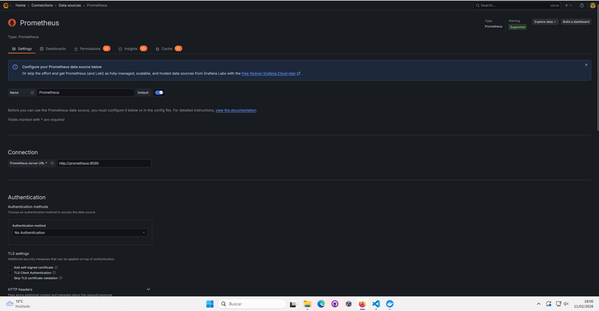
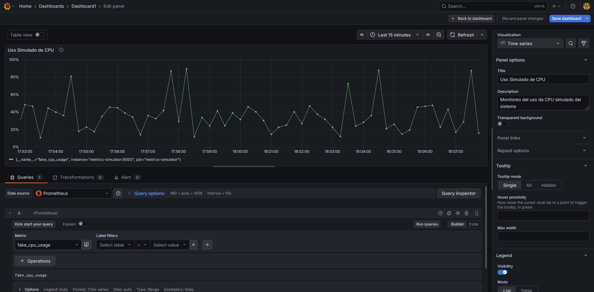
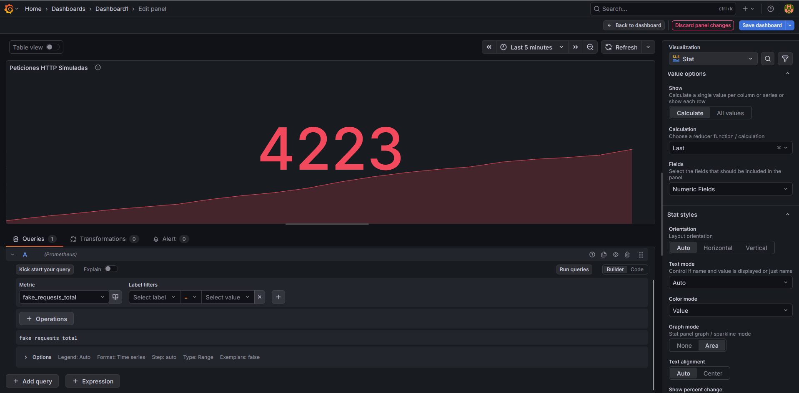
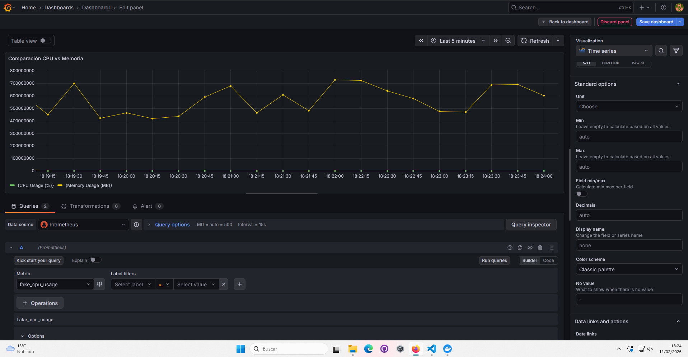
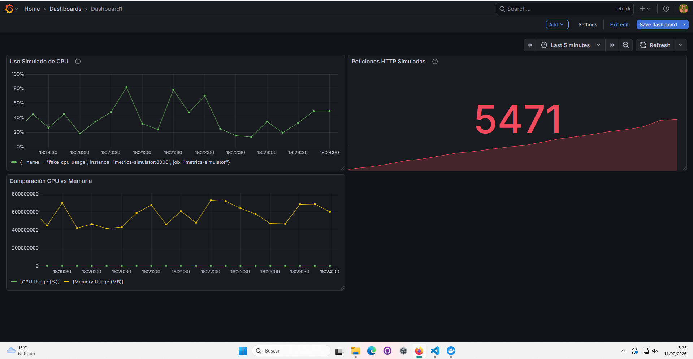
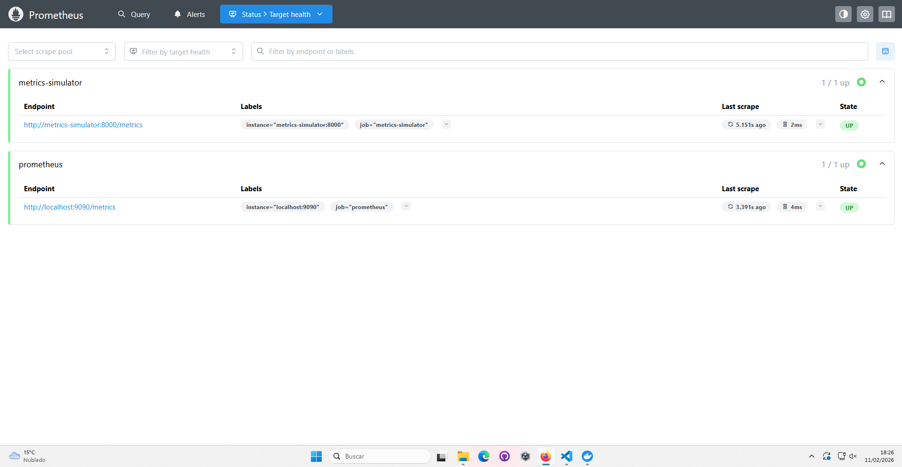

# UD3 - Laboratorio Grafana  
## Visualizacion de metricas y observabilidad  
### Documento de entrega y rubrica

---

## 1. Datos del grupo

Alumno o alumna(s):

- Nombre y apellidos: Juan Manuel Vega
- Nombre y apellidos (si procede):

Grupo: 2526-BDA
Fecha de entrega: 11 de febrero de 2026

---

## 2. Objetivo del laboratorio

El objetivo de este laboratorio es trabajar con Grafana como herramienta de visualizacion de metricas temporales y observabilidad tecnica, utilizando Prometheus como fuente de datos, y creando paneles y dashboards a partir de las metricas generadas por un servicio simulado.

---

## 3. Entorno de trabajo

Indica el entorno utilizado:

- Sistema operativo: Windows 11
- Contenedores utilizados (Docker o Podman): Docker Desktop
- Version de Grafana: latest (v10.3.1)
- Version de Prometheus: latest (v2.48.0)

---

## 4. Configuracion de la fuente de datos

Indica si se ha realizado correctamente la configuracion de Prometheus como fuente de datos en Grafana.

Marca lo que proceda:

- [x] Prometheus configurado como Data Source
- [x] Conexion verificada correctamente
- [x] No se han producido errores en la conexion

Breve descripcion (opcional):
Se configuró Prometheus como fuente de datos usando la URL interna http://prometheus:9090. La conexión se verificó correctamente mostrando el mensaje "Data source is working". El sistema recopila métricas del simulador cada 5 segundos.

---

## 5. Paneles obligatorios

En este laboratorio son **obligatorios los Paneles 1 y 2**.  
El Panel 3 es **opcional** y permite mejorar la calificacion.

---

### 5.1 Panel 1 - Uso simulado de CPU (OBLIGATORIO)

- [x] Panel creado correctamente
- [x] Metrica utilizada: `fake_cpu_usage`
- [x] Tipo de visualizacion adecuado (Time series)
- [x] Titulo del panel correcto

Breve descripcion de la informacion que aporta el panel:
Este panel muestra el uso simulado de CPU en tiempo real, con valores que oscilan entre 0% y 100%. Permite visualizar la evolución temporal del rendimiento del sistema, identificar picos de carga y patrones de uso. La visualización Time Series facilita la detección de tendencias y anomalías en el consumo de recursos.

---

### 5.2 Panel 2 - Peticiones simuladas (OBLIGATORIO)

- [x] Panel creado correctamente
- [x] Metrica utilizada: `fake_requests_total`
- [x] Tipo de visualizacion adecuado (Time series o Stat)
- [x] Titulo del panel correcto

Breve descripcion de la informacion que aporta el panel:
Este panel monitoriza el número total de peticiones HTTP procesadas por el sistema. Muestra el contador acumulativo de requests, permitiendo observar la carga de trabajo y el flujo de tráfico. Es esencial para detectar picos de demanda, caídas en el servicio y evaluar el rendimiento general de la aplicación.

---

### 5.3 Panel 3 - Comparacion de metricas (OPCIONAL)

Este panel es **opcional** y permite mejorar la calificacion final.

- [x] Panel creado
- [x] Se utilizan al menos dos metricas
- [x] Panel correctamente interpretado

Breve descripcion del panel:
Panel comparativo que correlaciona el uso de CPU (`fake_cpu_usage`) con el consumo de memoria (`fake_memory_usage_bytes`). Permite identificar relaciones entre ambos recursos y detectar si un aumento en el procesamiento implica mayor consumo de memoria. La visualización simultánea facilita el análisis integral del rendimiento del sistema y la identificación de cuellos de botella.

---

## 6. Dashboard final

Describe el dashboard creado a partir de los paneles anteriores:

- Numero total de paneles: 3 paneles
- Organizacion general del dashboard: Panel de CPU en la parte superior, panel de peticiones HTTP en la zona central, y panel comparativo CPU/Memoria en la parte inferior. Distribución equilibrada para facilitar la lectura.
- Objetivo del dashboard: Monitorización integral de la infraestructura simulada, proporcionando visibilidad completa sobre recursos (CPU, memoria) y carga de trabajo (peticiones HTTP) en tiempo real.

---

## 7. Analisis e interpretacion

Responde de forma razonada:

1. Que informacion se obtiene rapidamente del dashboard?
El dashboard proporciona una visión instantánea del estado del sistema: nivel actual de CPU, número total de peticiones procesadas, consumo de memoria y tendencias temporales de todos estos recursos. Permite identificar rápidamente si el sistema está bajo carga normal, experimentando picos de demanda o presenta anomalías en el rendimiento.

2. Que tipo de problemas tecnicos podrian detectarse con estas metricas?
- Sobrecarga de CPU (valores consistentemente altos)
- Degradación del rendimiento (caída en peticiones procesadas)
- Fugas de memoria (incremento sostenido sin liberación)
- Patrones anómalos de tráfico (picos inesperados o ausencia de requests)
- Correlaciones problemáticas (alto CPU sin correspondiente carga de trabajo)

3. Que limitaciones tiene este enfoque de observabilidad?
- Métricas sintéticas que no reflejan problemas reales
- Falta de contexto de negocio y trazabilidad de errores
- Ausencia de información sobre latencia y throughput
- No incluye métricas de aplicación específicas
- Limitado a nivel de infraestructura, sin visibilidad de logs o eventos

---

## 8. Comparacion Grafana vs Kibana

Desde tu experiencia practica, responde:

1. Para que tipo de datos resulta mas adecuado Grafana?
Grafana es ideal para métricas numéricas y series temporales: CPU, memoria, red, métricas de aplicación, KPIs de negocio, datos IoT. Excellent para monitorización de infraestructura, alerting basado en umbrales y visualización de tendencias temporales con gráficas interactivas.

2. En que casos seguirias utilizando Kibana?
Kibana es superior para análisis de logs estructurados y no estructurados, búsquedas textuales complejas, investigación de incidentes, análisis forense, auditorías de seguridad. Mejor para explorar grandes volúmenes de datos heterogéneos y descubrir patrones ocultos en eventos.

3. Consideras que son herramientas complementarias? Por que?
Sí, son altamente complementarias. Grafana monitoriza "qué está pasando" (métricas en tiempo real), mientras Kibana investiga "por qué pasó" (logs y eventos). En un stack completo de observabilidad, Grafana detecta problemas y Kibana los diagnostica, creando un flujo de trabajo integral de monitorización y resolución.

---

## 9. Dificultades encontradas

Describe brevemente cualquier dificultad tecnica o conceptual encontrada y como se resolvio.

Principal dificultad: Inicialmente los paneles mostraban "No data" debido a queries incorrectas (uso de `increase()` con intervalos demasiado amplios). Se resolvió simplificando las queries a métricas directas (`fake_cpu_usage`, `fake_requests_total`) y ajustando el rango temporal a períodos más cortos (5 minutos). También fue necesario verificar la conectividad entre contenedores y confirmar que el simulador estaba generando métricas correctamente.

---

## 10. Reflexion final

Reflexiona brevemente (5 a 10 lineas):

Grafana ha demostrado ser una herramienta potente para la visualización de métricas en tiempo real y observabilidad técnica. A diferencia de herramientas como Kibana (orientada a logs) o Excel (análisis estático), Grafana se especializa en métricas temporales con capacidades avanzadas de alerting y dashboards interactivos. Su integración con Prometheus crea un stack robusto para monitorización de infraestructura.

Considero esta herramienta especialmente útil en proyectos DevOps, sistemas distribuidos, aplicaciones en producción, monitorización de IoT y cualquier entorno donde la observabilidad en tiempo real sea crítica. Su capacidad de correlacionar múltiples fuentes de datos y crear vistas unificadas lo convierte en una pieza fundamental para equipos SRE y operaciones que requieren visibilidad proactiva del estado de sus sistemas.

---

# Rubrica de evaluacion

---

## Criterios de evaluacion

### Configuracion del entorno (2 puntos)

- [x] Fuente de datos Prometheus correctamente configurada (1 punto)
- [x] Entorno funcional sin errores (1 punto)

---

### Paneles obligatorios (5 puntos)

**Panel 1 - Uso simulado de CPU (2.5 puntos)**  
- [x] Metrica correcta  
- [x] Visualizacion adecuada  
- [x] Interpretacion correcta  

**Panel 2 - Peticiones simuladas (2.5 puntos)**  
- [x] Metrica correcta  
- [x] Visualizacion adecuada  
- [x] Interpretacion correcta  

---

### Panel opcional (1 punto)

**Panel 3 - Comparacion de metricas**

- [x] Panel correctamente creado
- [x] Uso adecuado de varias metricas

(Solo puntua si esta realizado)

---

### Dashboard final (1 punto)

- [x] Paneles correctamente integrados
- [x] Dashboard claro y coherente

---

### Analisis y reflexion (1 punto)

- [x] Respuestas razonadas
- [x] Comprension del enfoque de observabilidad

---

## Calificacion final

Puntuacion obtenida: **10** / 10

**Desglose:**
- Configuración del entorno: 2/2 puntos
- Paneles obligatorios: 5/5 puntos  
- Panel opcional: 1/1 punto
- Dashboard final: 1/1 punto
- Análisis y reflexión: 1/1 punto

---

## Fin del documento de entrega