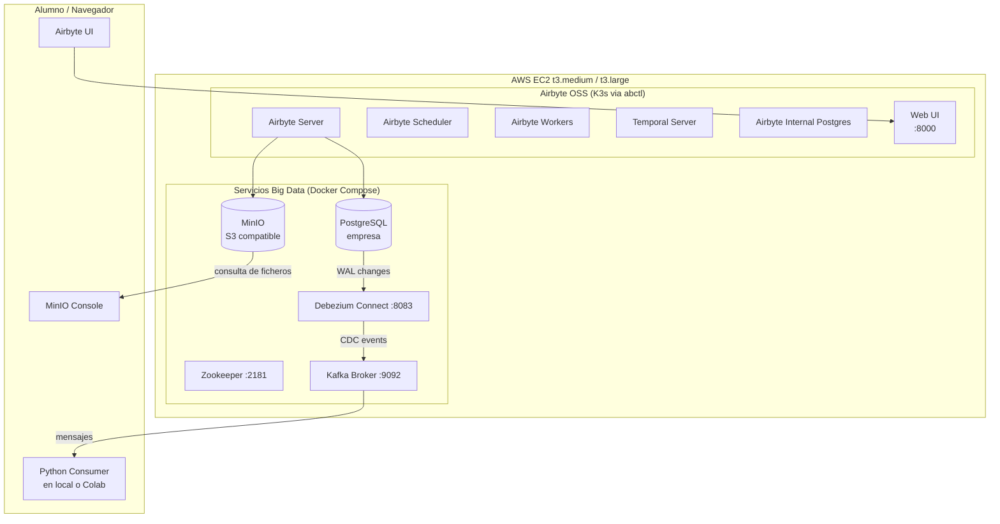

# 🟦 **ANEXO — Montaje de la práctica en una instancia EC2 (Airbyte OSS + Servicios Big Data)**

Este anexo describe cómo desplegar **Airbyte OSS**, **PostgreSQL**, **Kafka**, **Debezium** y **MinIO** en una máquina virtual EC2 de AWS, utilizando AWS Academy o una cuenta de laboratorio.

La infraestructura queda accesible **vía navegador** sin necesidad de que el alumnado instale nada localmente.

---

# 1. Selección y creación de la instancia EC2

### 1.1 Tipo de instancia recomendado

Para el entorno completo se recomienda:

* **t3.medium** (2 vCPU, 4 GB RAM) mínimo
* Si hay varios alumnos conectados simultáneamente → **t3.large** (2 vCPU, 8 GB RAM)

Ambas suelen entrar en créditos educativos de AWS Academy sin coste adicional.

### 1.2 AMI recomendada

* **Ubuntu Server 22.04 LTS**

### 1.3 Configuración de red

Crear o asignar un **Security Group** con las reglas:

| Servicio         | Puerto | Descripción                            |
| ---------------- | ------ | -------------------------------------- |
| HTTP             | 80     | Acceso web a Airbyte                   |
| Airbyte OSS UI   | 8000   | Interfaz Airbyte                       |
| Postgres         | 5432   | Acceso opcional para alumno o Debezium |
| Kafka            | 9092   | Transporte CDC                         |
| Zookeeper        | 2181   | Necesario para Kafka                   |
| Debezium Connect | 8083   | API REST del conector                  |
| MinIO Console    | 9001   | Interfaz S3                            |
| MinIO API        | 9000   | Endpoint S3                            |
| SSH              | 22     | Acceso administrativo                  |

*Opcional:*
Puedes restringir el acceso por IP (por ejemplo, solo IPs del centro educativo).

### 1.4 Acceder por SSH (si no funciona desde terminal)

Si desde el centro no deja conectar con SSH:

* Utilizar **AWS CloudShell**
* O conectar vía EC2 Instance Connect desde el navegador

---

# 2. Preparación del servidor

Actualizar:

```bash
sudo apt update && sudo apt upgrade -y
```

Instalar Docker:

```bash
curl -fsSL https://get.docker.com | sudo sh
sudo usermod -aG docker ubuntu
```

Instalar Docker Compose v2:

```bash
sudo apt install docker-compose-plugin -y
```

Cerrar sesión y volver a entrar.

---

# 3. Instalar Airbyte OSS con `abctl`

Airbyte OSS ya no se despliega con Docker Compose.
El método estable es `abctl` que instala automáticamente **K3s** y toda su stack.

### 3.1 Instalar abctl

```bash
curl -sSL https://get.airbyte.com/abctl.sh | bash
```

Comprobar:

```bash
abctl version
```

### 3.2 Inicializar y arrancar Airbyte

```bash
abctl init
abctl start
```

Obtener la URL:

```bash
abctl url
```

En EC2 será algo como:

```
http://<public-ip>:8000
```

---

# 4. Desplegar servicios Big Data con Docker Compose

Crear archivo:

```
docker-compose-bigdata.yaml
```

Incluye:

* PostgreSQL
* MinIO
* Zookeeper
* Kafka
* Debezium

```yaml
version: "3.9"

services:
  postgres:
    image: postgres:14
    environment:
      POSTGRES_USER: airbyte
      POSTGRES_PASSWORD: airbyte
      POSTGRES_DB: empresa
    ports:
      - "5432:5432"
    volumes:
      - pgdata:/var/lib/postgresql/data

  zookeeper:
    image: confluentinc/cp-zookeeper:7.5.0
    environment:
      ZOOKEEPER_CLIENT_PORT: 2181
    ports:
      - "2181:2181"

  kafka:
    image: confluentinc/cp-kafka:7.5.0
    environment:
      KAFKA_ZOOKEEPER_CONNECT: zookeeper:2181
      KAFKA_ADVERTISED_LISTENERS: PLAINTEXT://0.0.0.0:9092
      KAFKA_LISTENER_SECURITY_PROTOCOL_MAP: PLAINTEXT:PLAINTEXT
      KAFKA_OFFSETS_TOPIC_REPLICATION_FACTOR: 1
    ports:
      - "9092:9092"
    depends_on:
      - zookeeper

  debezium:
    image: debezium/connect:2.3
    environment:
      BOOTSTRAP_SERVERS: kafka:9092
      GROUP_ID: 1
      CONFIG_STORAGE_TOPIC: debezium_config
      OFFSET_STORAGE_TOPIC: debezium_offsets
      STATUS_STORAGE_TOPIC: debezium_status
    ports:
      - "8083:8083"
    depends_on:
      - kafka
      - postgres

  minio:
    image: minio/minio
    command: server /data
    environment:
      MINIO_ROOT_USER: minio
      MINIO_ROOT_PASSWORD: minio123
    ports:
      - "9000:9000"
      - "9001:9001"
    volumes:
      - minio_data:/data

volumes:
  pgdata:
  minio_data:
```

Levantar:

```bash
docker compose -f docker-compose-bigdata.yaml up -d
```

Comprobar:

```bash
docker compose ps
```

---

# 5. Configurar Airbyte en EC2

### 5.1 Fuente: PostgreSQL local

En Airbyte → Sources → PostgreSQL:

| Campo    | Valor                            |
| -------- | -------------------------------- |
| Host     | docker (según red) o `127.0.0.1` |
| Port     | 5432                             |
| User     | airbyte                          |
| Password | airbyte                          |
| Database | empresa                          |

*Si Airbyte no ve Docker (muy común):*
Usar:

```
Host: host.docker.internal
```

### 5.2 Destino: MinIO (S3-compatible)

| Campo       | Valor                                          |
| ----------- | ---------------------------------------------- |
| Endpoint    | [http://localhost:9000](http://localhost:9000) |
| Access Key  | minio                                          |
| Secret Key  | minio123                                       |
| Bucket      | datalake                                       |
| Path Prefix | raw/                                           |

---

# 6. Configurar CDC con Debezium → Kafka

Registrar:

```bash
curl -X POST http://<public-ip>:8083/connectors \
  -H "Content-Type: application/json" \
  -d '{
        "name": "clientes-cdc",
        "config": {
          "connector.class": "io.debezium.connector.postgresql.PostgresConnector",
          "plugin.name": "pgoutput",
          "database.hostname": "postgres",
          "database.port": "5432",
          "database.user": "airbyte",
          "database.password": "airbyte",
          "database.dbname": "empresa",
          "topic.prefix": "cdc"
        }
      }'
```

---

# 7. Consumidor Python desde fuera (por ejemplo, Colab)

```python
from kafka import KafkaConsumer
import json

consumer = KafkaConsumer(
    'cdc.public.clientes',
    bootstrap_servers='<public-ip>:9092',
    auto_offset_reset='earliest',
    value_deserializer=lambda m: json.loads(m.decode('utf-8'))
)

for msg in consumer:
    print(msg.value)
```

---

# 8. Consideraciones de seguridad

⚠️ **Importante:** si expones Kafka, MinIO o Postgres:

* Limitar acceso por IP
* Usar Security Groups estrictos
* Cerrar puertos al acabar la práctica
* No dejar credenciales por defecto

Eventualmente, puedes borrar toda la instancia para evitar costes.

---

# Anexo: Diagramas de la arquitectura

## 🟦 **1. Diagrama EC2 — Arquitectura general (versión clara)**

```mermaid
flowchart LR

    subgraph EC2["Instancia EC2 (Ubuntu 22.04)"]
        A1[Airbyte OSS\n(abctl + K3s)]
        A2[PostgreSQL\n(empresa)]
        A3[MinIO\n(S3 compatible)]
        A4[Kafka Broker]
        A5[Zookeeper]
        A6[Debezium Connect]
    end

    subgraph Alumno["Alumno (portátil/web)"]
        B1[Airbyte UI\nhttp://IP:8000]
        B2[MinIO Console\nhttp://IP:9001]
        B3[Consumer Python\n(local o Colab)]
    end

    %% Batch/incremental flow
    A1 -- Ingesta ELT --> A3
    A1 -- Lectura origen --> A2

    %% CDC
    A2 -- Cambios --> A6
    A6 -- Eventos CDC --> A4
    A4 -- Mensajes --> B3
```

---

## 🟦 **2. Diagrama EC2 — Arquitectura completa con flujos detallados**



---

