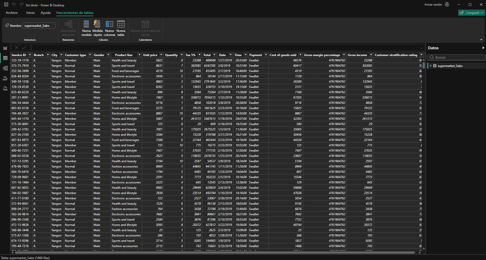
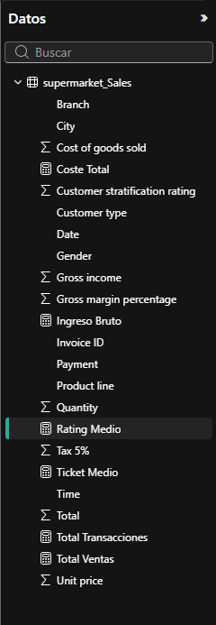
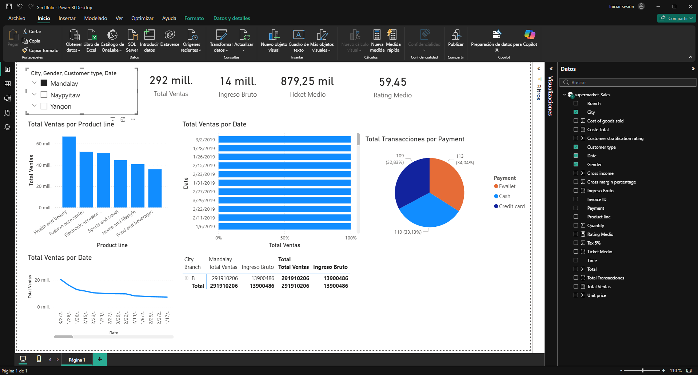
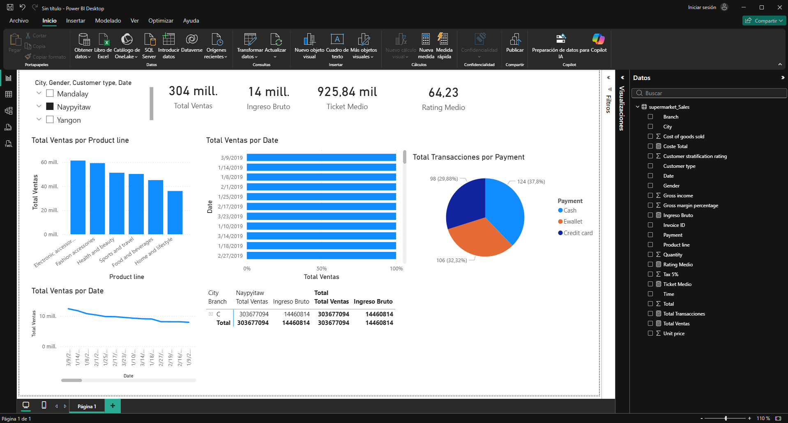

# UD4 - Laboratorio
## Documento de entrega - Power BI para Business Intelligence

---

## Datos del grupo

- Módulo: Sistemas de Big Data
- Unidad: UD4 - BI y Orquestación
- Curso: 2025-2026
- Grupo: 1
- Integrantes: Juan Manuel Vega
- Fecha de entrega: 10/03/2026

---

# 1. Modo de trabajo seleccionado

**Indicar la opción utilizada:**

- [x] **Power BI Desktop** (aplicación Windows)
- [ ] **Power BI Service** (navegador/web - app.powerbi.com)

## 1.1 Justificación

Explicar brevemente por qué se ha elegido esta opción:

- Si Power BI Desktop: ¿Por qué? (facilidad de uso, necesidad de DAX, etc.)
- Si Power BI Service: ¿Por qué? (Linux, accesibilidad, sin instalación)

Se ha elegido Power BI Desktop porque permite trabajar de forma completa con modelado de datos, creación de medidas DAX y diseño de visualizaciones interactivas en un único entorno. Para esta práctica era importante poder definir indicadores personalizados (ventas, ticket medio, ingreso bruto) y controlar el formato del informe.

---

# 2. Descripción del trabajo realizado

## 2.1 Objetivo del dashboard

Explicar brevemente:

- Qué pregunta de negocio responde el dashboard.
- Qué datos se han utilizado.
- Qué tipo de análisis permite.

El dashboard responde a la pregunta: **qué sucursal, ciudad, línea de producto y método de pago generan mayor rendimiento comercial**.

Se han utilizado los datos del archivo `supermarket_Sales.csv`, con información de tickets de compra (factura, sucursal, ciudad, tipo de cliente, género, línea de producto, importe total, fecha, método de pago, ingresos brutos y rating).

El análisis permite:
- ver KPIs generales de ventas y rentabilidad,
- comparar ventas por ciudad y por línea de producto,
- observar la evolución temporal de ventas,
- filtrar por ciudad, género, tipo de cliente y fecha.

---

# 3. Datos y modelo

## 3.1 Origen de datos

Indicar:

- Tipo de archivo/fuente utilizada.
- Número de registros/filas.
- Estructura básica (nombre de campos).

- Tipo de archivo/fuente utilizada: CSV local (`supermarket_Sales.csv`).
- Número de registros/filas: 1000 registros (1001 líneas contando cabecera).
- Estructura básica (campos): Invoice ID, Branch, City, Customer type, Gender, Product line, Unit price, Quantity, Tax 5%, Total, Date, Time, Payment, Cost of goods sold, Gross margin percentage, Gross income, Customer stratification rating.

## 3.2 Modelo de datos

**Solo aplicable si se usa Power BI Desktop:**

Adjuntar captura de la vista Modelo (diagrama de relaciones).

Describir:

- Tabla de hechos identificada.
- Tablas de dimensiones identificadas.
- Relaciones creadas (cardinalidad: 1:N, etc.).

Se ha trabajado con un **modelo de una sola tabla**.

- Tabla de hechos identificada: `supermarket_Sales`.
- Tablas de dimensiones identificadas: no se han separado físicamente en tablas independientes; se han usado dimensiones lógicas dentro de la misma tabla (`City`, `Branch`, `Product line`, `Gender`, `Customer type`, `Payment`, `Date`).
- Relaciones creadas: no aplica en este caso al existir una única tabla en el modelo.

**Si se usa Power BI Service:**

El modelo se crea automáticamente al importar datos. Indicar si se han creado relaciones o se ha trabajado con una sola tabla.

**Pregunta de reflexión:**
¿Por qué es importante un modelo de datos correcto en BI?

Un modelo de datos correcto en BI es clave porque evita duplicidades y errores de agregación, mejora el rendimiento de las consultas y garantiza que los indicadores se calculen de forma consistente en todas las visualizaciones. Además, facilita el mantenimiento y la escalabilidad del informe.

**Captura vista Modelo:**

---

# 4. Medidas y cálculos

## 4.1 Medidas creadas

**Solo aplicable si se usa Power BI Desktop (DAX):**

Para cada medida creada, indicar:

| Nombre | Fórmula DAX | Descripción |
|--------|-------------|-------------|
| Total Ventas | `Total Ventas = SUM('supermarket_Sales'[Total])` | Suma total de ventas del periodo analizado. |
| Total Transacciones | `Total Transacciones = DISTINCTCOUNT('supermarket_Sales'[Invoice ID])` | Número de tickets/facturas únicas. |
| Ingreso Bruto | `Ingreso Bruto = SUM('supermarket_Sales'[Gross income])` | Margen bruto generado por las ventas. |
| Coste Total | `Coste Total = SUM('supermarket_Sales'[Cost of goods sold])` | Coste total de los productos vendidos. |
| Ticket Medio | `Ticket Medio = DIVIDE([Total Ventas], [Total Transacciones], 0)` | Importe medio por transacción. |
| Rating Medio | `Rating Medio = AVERAGE('supermarket_Sales'[Customer stratification rating])` | Valoración media de clientes. |

**Si se usa Power BI Service:**

Power BI Service no permite crear medidas DAX. Indicar qué alternativas se han utilizado:

- [ ] Campos agregados automático (Sigma Σ)
- [ ] Q&A para consultas dinámicas
- [ ] Solo visualización de datos importados
- [ ] Otra forma

## 4.2 Diferencia conceptual

**Solo para Power BI Desktop:**

Explicar con tus propias palabras:

- ¿Por qué usar medidas en lugar de columnas calculadas?
- ¿Qué significa "contexto de filtro"?

Las medidas son preferibles cuando el resultado debe cambiar dinámicamente según la visualización y los filtros activos. Una columna calculada se evalúa fila a fila al cargar/refrescar datos y queda almacenada, mientras que una medida se calcula en tiempo de consulta.

El **contexto de filtro** es el conjunto de filtros aplicados en un momento dado (segmentadores, ejes, selecciones en gráficos, filtros de página o informe). Ese contexto determina el valor que devuelve cada medida.

**Captura medidas y campos:**

**Para Power BI Service:**

Explicar las limitaciones de no tener DAX:

- ¿Qué operaciones se pueden hacer?
- ¿Qué ventajas tiene trabajar sin fórmulas?

---

# 5. Visualizaciones

## 5.1 Elementos del dashboard

Indicar qué visualizaciones se han creado:

| Visualización | Tipo | Campos utilizados | Propósito |
|---------------|------|-------------------|------------|
| KPI Ventas | Tarjeta | Total Ventas | Mostrar indicador principal |
| KPI Ingreso Bruto | Tarjeta | Ingreso Bruto | Mostrar margen bruto total |
| KPI Ticket Medio | Tarjeta | Ticket Medio | Medir valor medio por compra |
| KPI Rating Medio | Tarjeta | Rating Medio | Medir satisfacción media del cliente |
| Ventas por línea de producto | Columnas agrupadas | Product line, Total Ventas | Comparar rendimiento por categoría |
| Ventas por ciudad | Barras | City, Total Ventas | Identificar ciudades con mayor facturación |
| Transacciones por método de pago | Circular | Payment, Total Transacciones | Analizar preferencia de pago |
| Evolución de ventas | Línea | Date, Total Ventas | Observar tendencia temporal |
| Detalle comercial | Tabla | Branch, City, Product line, Total Ventas, Ingreso Bruto | Revisar detalle por segmento |

## 5.2 Diseño del dashboard

Adjuntar captura del dashboard final.

Describir:

- Criterios de layout utilizados.
- Uso de segmentadores (slicers) - solo en Power BI Service disponibles directamente en dashboards.
- Interacciones entre visualizaciones.

Se ha usado un layout en tres zonas:
- parte superior para KPIs generales,
- zona central para comparativas por producto/ciudad/pago,
- parte inferior para evolución temporal y tabla de detalle.

Se han añadido segmentadores para `City`, `Gender`, `Customer type` y `Date`, permitiendo filtrar el informe de forma interactiva.

Las visualizaciones están conectadas entre sí: al seleccionar una categoría o ciudad en un gráfico, el resto de gráficos y KPIs se actualizan automáticamente según el contexto de filtro.

**Captura informe creado:**

**Captura dashboard final:**

---

# 6. Creación del dashboard

## 6.1 Power BI Desktop

Pasos realizados:

1. Crear informe (pestañas/páginas)
2. Añadir visualizaciones al lienzo
3. Guardar archivo `.pbix`
4. Publicar en Power BI Service (opcional)

Pasos realizados en esta práctica:
1. Importación del archivo CSV y validación de tipos de dato.
2. Construcción del modelo con una tabla principal (`supermarket_Sales`).
3. Creación de medidas DAX para KPIs de ventas, margen y ticket medio.
4. Diseño del informe con tarjetas, gráficos comparativos, serie temporal y tabla.
5. Añadido de segmentadores para análisis interactivo.
6. Guardado del archivo `.pbix` y preparación de capturas para la memoria.

## 6.2 Power BI Service

Pasos realizados:

1. Importar datos → Crear modelo semántico
2. Crear informe desde el modelo
3. Anclar visualizaciones al dashboard
4. Editar layout del dashboard

**Adjuntar capturas de:**

- Modelo semántico o de datos
- Informe creado
- Dashboard final

**Captura adicional de resultado final:**

---

# 7. Publicación y compartición

## 7.1 Power BI Desktop

- ¿Se ha publicado en Power BI Service?
- Workspace utilizado.
- Enlace de acceso (si procede).

- ¿Se ha publicado en Power BI Service?: No (opcional en esta práctica).
- Workspace utilizado: No aplica.
- Enlace de acceso: No aplica.

## 7.2 Power BI Service

- ¿Se ha compartido el dashboard?
- Permisos configurados (solo lectura / puede editar).
- Enlace de acceso (si se ha compartido).

No aplica, al haberse trabajado con Power BI Desktop sin compartición en Service.

---

# 8. Análisis conceptual

Responde de forma razonada:

1. ¿Qué diferencias has observado entre Power BI y las herramientas vistas anteriormente (Metabase, Superset)?
2. ¿Qué ventajas tiene el modelo semántico de Power BI?
3. ¿En qué escenarios sería mejor usar DirectQuery en lugar de Import?
4. ¿Dónde debería realizarse el cálculo pesado: en Spark o en Power BI?
5. ¿Qué tipo de empresas utilizan Power BI como herramienta principal de BI?
6. **¿Qué limitaciones has encontrado al usar Power BI Service comparado con Desktop?**
7. **¿Qué ventajas tiene usar Power BI Service para usuarios de Linux?**

1. Power BI destaca frente a Metabase y Superset por su integración entre transformación de datos, modelado semántico, lenguaje DAX y visualización en una sola herramienta de autoría.
2. El modelo semántico permite definir métricas comunes reutilizables, mejorar la consistencia de resultados y reducir errores al escalar informes.
3. DirectQuery es recomendable cuando los datos son muy grandes, cambian con frecuencia o se requiere consulta casi en tiempo real sin importar grandes volúmenes a memoria.
4. El cálculo pesado debe ejecutarse en Spark/ETL o en el origen de datos; Power BI debe centrarse en agregación analítica y visualización.
5. Power BI se usa ampliamente en pymes y grandes empresas, especialmente en entornos con Microsoft 365, Azure y necesidades de autoservicio BI.
6. En Power BI Service hay limitaciones de autoría respecto a Desktop (modelado y desarrollo avanzado), aunque mejora la colaboración y distribución.
7. Para usuarios de Linux, Power BI Service es ventajoso por acceso web sin instalación local nativa y facilidad para compartir dashboards.

---

# 9. Comparativa técnica

Completar la siguiente tabla:

| Aspecto | Metabase | Superset | Power BI Desktop | Power BI Service |
|----------|----------|----------|------------------|------------------|
| Licencia | Open source | Open source | Gratis para autoría local (Pro para compartir en organización) | Suscripción (Free/Pro/Premium según capacidades) |
| Requiere instalación | Sí (servidor o Docker) | Sí (servidor o Docker) | Sí (aplicación Windows) | No (navegador web) |
| Modelo semántico | Básico | Medio | Avanzado | Consume modelos publicados |
| Lenguaje DAX | No | No | Sí | Limitado para autoría directa |
| Trabajo en Linux | Sí | Sí | No nativo | Sí |
| Power Query/Transformación | No (limitado) | No (enfoque SQL) | Sí (Power Query completo) | Muy limitado frente a Desktop |

---

# 10. Extensión (si se realizó)

Indicar si se realizó alguna ampliación:

**Para Power BI Desktop:**

- Nueva medida DAX avanzada (CALCULATE, FILTER, etc.)
- Jerarquía de fechas
- Drill-through entre páginas
- Columnas calculadas

**Para Power Power BI Service:**

- Uso de Q&A para generar visualizaciones
- Uso de Copilot (si disponible)
- Creación de múltiples dashboards
- Vinculación a OneDrive/SharePoint

Explicar brevemente.

No se ha realizado ampliación adicional. La práctica se ha centrado en completar correctamente el flujo base de BI: carga de datos, medidas DAX, visualizaciones, segmentación e interpretación de resultados.

---

# 11. Reflexión final

Responder:

- ¿Qué parte ha resultado más clara?
- ¿Qué parte ha resultado más compleja?
- ¿Entiendes ahora el papel de Power BI en el ecosistema Big Data?
- ¿Consideras útil Power BI para tu futuro profesional? ¿Por qué?
- ¿Qué opción prefieres: Desktop o Service? ¿Por qué?

- La parte más clara ha sido la creación de visualizaciones y segmentadores para explorar la información de ventas.
- La parte más compleja ha sido entender la diferencia entre medidas y columnas calculadas, y cómo afecta el contexto de filtro.
- Sí, ahora se entiende mejor el papel de Power BI como capa de análisis y consumo sobre datos previamente procesados en plataformas Big Data.
- Sí, es útil para el futuro profesional porque es una herramienta muy utilizada en empresas para análisis de negocio, reporting y toma de decisiones.
- Para crear informes prefiero **Power BI Desktop** por su capacidad de modelado y DAX; para compartir resultados, **Power BI Service** es el complemento ideal.

---

# 12. Rúbrica de evaluación

| Criterio | Excelente (9-10) | Notable (7-8) | Aprobado (5-6) | Insuficiente (<5) |
|----------|-----------------|---------------|---------------|------------------|
| Modelo de datos | Relaciones correctas y bien justificadas | Relaciones correctas | Modelo básico sin optimizar | Sin modelo o incorrecto |
| Medidas/Cálculos | Medidas DAX correctas o uso eficiente de alternativas | Medidas correctas | Medida básica | Sin medidas o incorrectas |
| Visualizaciones | Coherentes y bien diseñadas | Visualizaciones correctas | Visualizaciones mínimas | Sin visualizaciones |
| Dashboard | Diseño claro y profesional | Diseño correcto | Dashboard básico | Sin dashboard |
| Análisis conceptual | Reflexión profunda sobre BI | Reflexión correcta | Reflexión superficial | Sin reflexión |
| Documentación | Documento estructurado y completo | Documento correcto | Documento mínimo | Documento incompleto |

---

## Nota importante

No se evaluará la complejidad técnica avanzada.
Se valorará la comprensión del concepto de Business Intelligence y la capacidad de crear un dashboard funcional.

Para Power BI Service: se evaluará el uso eficiente de las herramientas disponibles en la versión web.
Para Power BI Desktop: se evaluará el uso de DAX y el modelado de datos.

---

## Archivos a entregar

**Para Power BI Desktop:**

1. Archivo `.pbix`
2. Capturas de pantalla del trabajo realizado
3. Este documento de entrega cumplimentado

**Para Power BI Service:**

1. Enlace al dashboard publicado (o capturas)
2. Capturas de pantalla del trabajo realizado
3. Este documento de entrega cumplimentado

---

## Fin del documento
