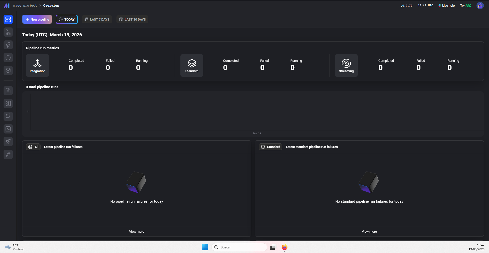
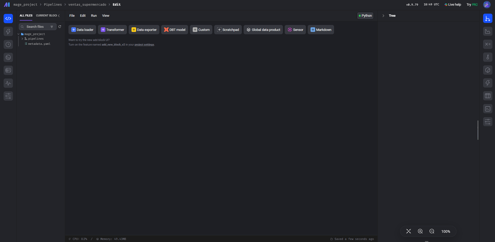
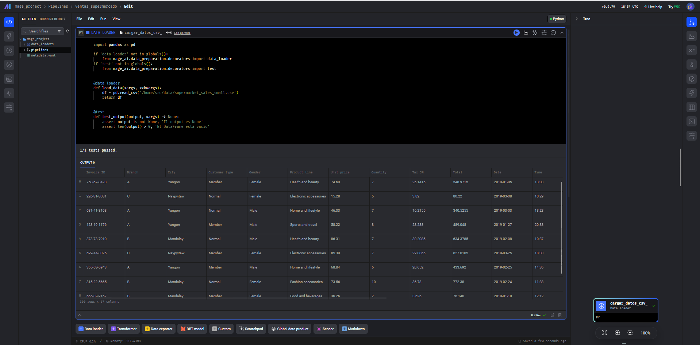
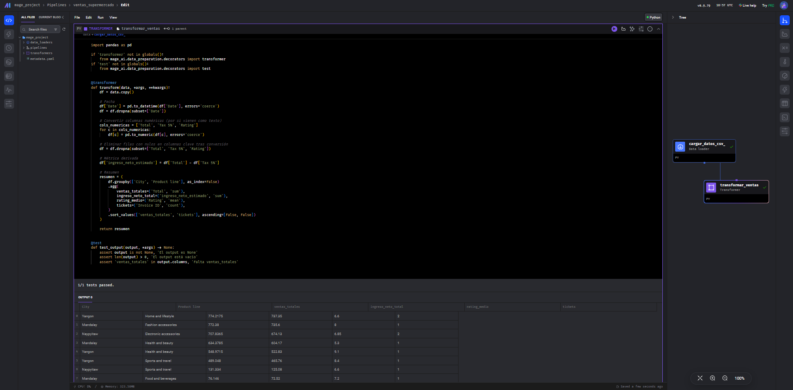
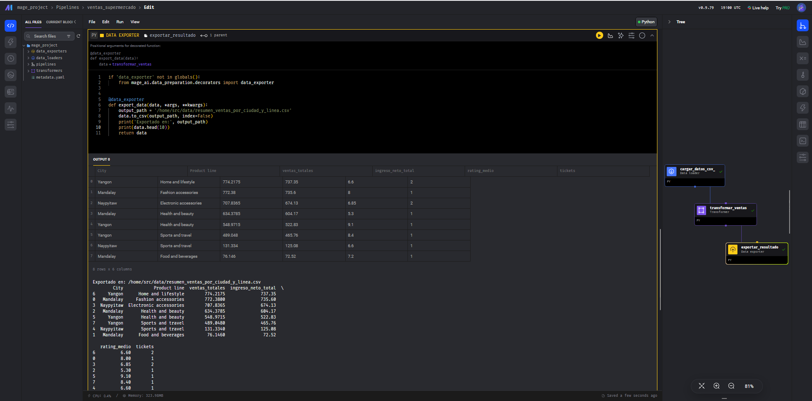
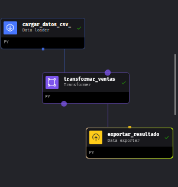
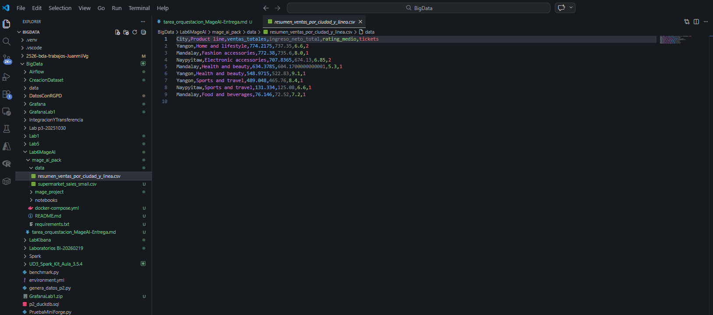

# Documento de Entrega - Practica Mage AI

## 1. Descripcion del pipeline

Se ha desarrollado un pipeline batch en Mage AI llamado `ventas_supermercado` para procesar un dataset de ventas de supermercado.

El flujo implementado contiene tres bloques:

1. `Data Loader` (`cargar_datos_csv`): carga el CSV de entrada.
2. `Transformer` (`transformar_ventas`): limpia y transforma los datos para obtener un resumen analitico.
3. `Data Exporter` (`exportar_resultado`): exporta el resultado final a un nuevo archivo CSV.

Dataset utilizado:

- Archivo: `supermarket_sales_small.csv`
- Ruta en proyecto: `mage_ai_pack/data/supermarket_sales_small.csv`
- Tamano final para la practica: 300 filas

## 2. Transformaciones aplicadas

En el bloque `Transformer` se han aplicado las siguientes transformaciones:

1. Conversion de la columna `Date` a tipo fecha.
2. Eliminacion de filas con fechas invalidas (`NaT`).
3. Conversion de columnas numericas (`Total`, `Tax 5%`, `Rating`) a tipo numerico para evitar errores de tipo.
4. Eliminacion de filas con nulos en columnas clave tras la conversion.
5. Creacion de la columna derivada `ingreso_neto_estimado` como:

   `ingreso_neto_estimado = Total - Tax 5%`

6. Agrupacion por `City` y `Product line` para generar indicadores:
   - `ventas_totales`
   - `ingreso_neto_total`
   - `rating_medio`
   - `tickets`
7. Ordenacion del resultado por `ventas_totales` y `tickets` de mayor a menor.

Justificacion:

- Estas transformaciones permiten limpiar datos, evitar errores de operacion entre strings y obtener un resumen util para analisis de negocio.

## 3. Resultado obtenido

El pipeline genera un archivo final con metricas agregadas por ciudad y linea de producto.

- Archivo de salida: `resumen_ventas_por_ciudad_y_linea.csv`
- Ruta de salida en contenedor: `/home/src/data/resumen_ventas_por_ciudad_y_linea.csv`
- Ruta en proyecto local: `mage_ai_pack/data/resumen_ventas_por_ciudad_y_linea.csv`

Informacion que aporta:

1. Que ciudades y lineas de producto concentran mayor volumen de ventas.
2. Comparacion del ingreso neto estimado por segmento.
3. Satisfaccion media de clientes por categoria (`rating_medio`).
4. Numero de tickets por grupo para estimar frecuencia de compra.

Posibles usos:

1. Priorizacion de inventario por ciudad/categoria.
2. Ajuste de campanas comerciales segun rendimiento.
3. Seguimiento de KPIs de ventas en procesos periodicos automatizados.

## 4. Evidencias (capturas)

### 4.1 Pipeline completo en Mage

### 4.2 Ejecucion correcta del pipeline

### 4.3 Resultado final (output exportado)

### 4.4 Evidencias adicionales de bloques

#### Data Loader en ejecucion/success

#### Transformer en ejecucion/success

#### Data Exporter en ejecucion/success

#### Verificacion adicional del resultado

## 5. Checklist de entrega

- [x] Pipeline funcional sin errores.
- [x] Bloques implementados: Data Loader, Transformer y Data Exporter.
- [x] Dataset CSV identificado.
- [x] Evidencias incluidas (pipeline, ejecucion y output).
- [x] Documento breve en formato Markdown.
