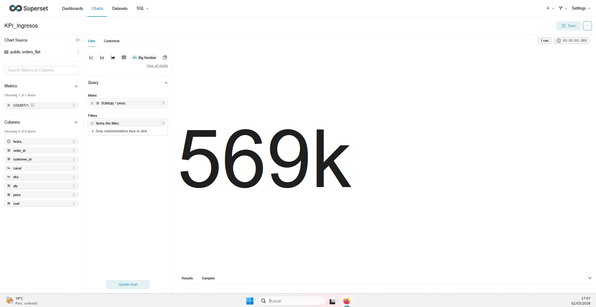
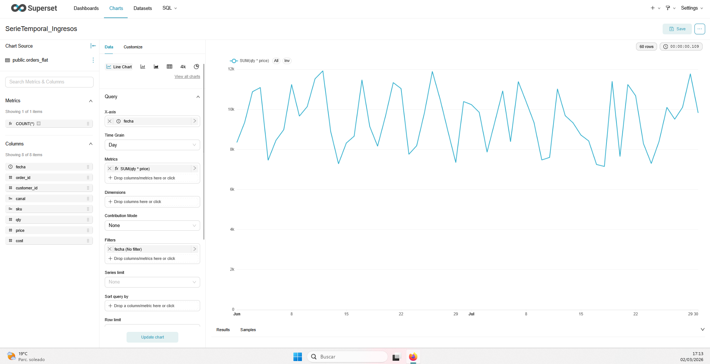
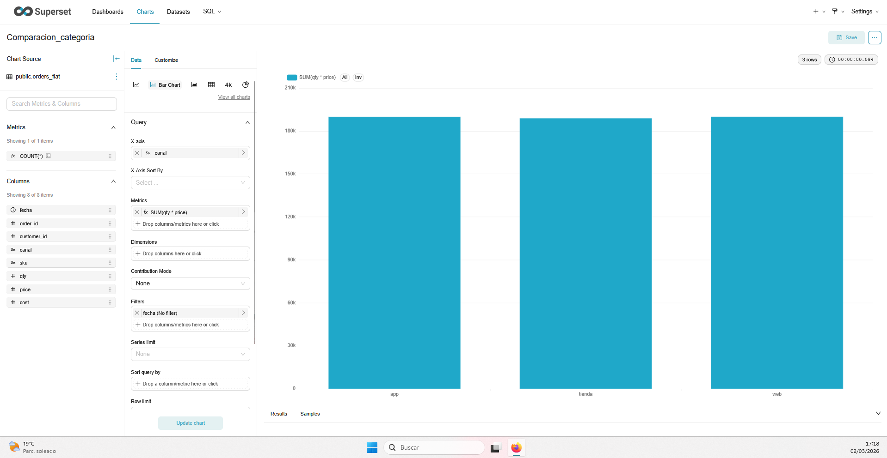
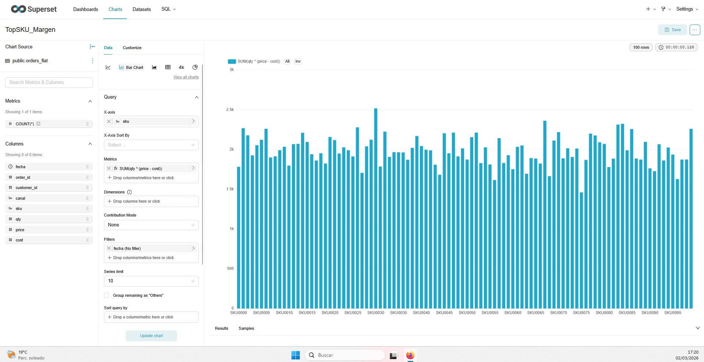
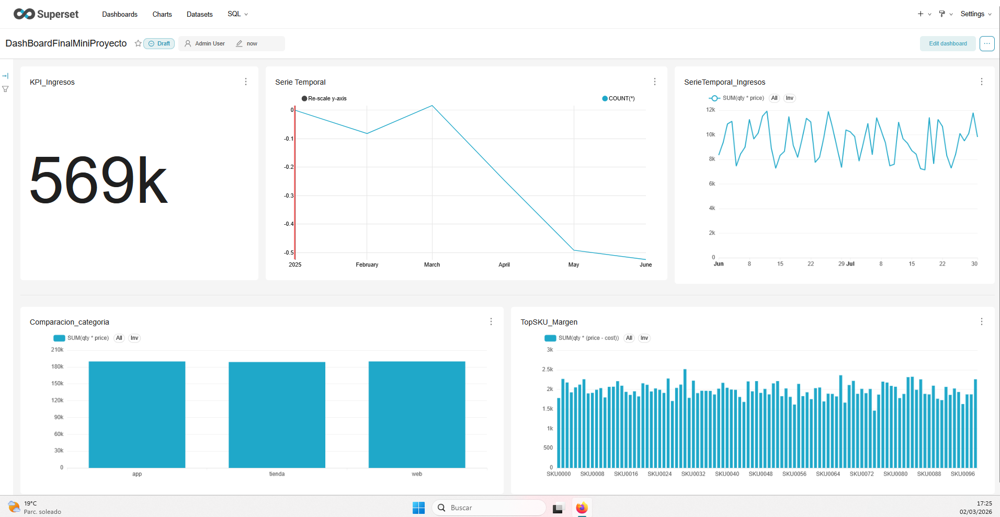

# UD4 - Mini-Proyecto
## Documento de Entrega

---

# 1. Datos del grupo

Nombre del grupo: BI-UD4-MiniProyecto

Integrantes:

- Juan Manuel Vega

Fecha: 02/03/2026

Herramienta utilizada (Metabase / Superset): Superset

---

# 2. Definición del problema

Describir:

- Problema a analizar: evolución de ingresos y rentabilidad operativa por canal y producto en un entorno de ventas con alto volumen de transacciones.
- Contexto: dataset transaccional `public.orders_flat` con 22.579 registros entre junio y julio de 2024, con información de fecha, canal, SKU, cantidad, precio y coste.
- Usuario objetivo: responsable de negocio/operaciones que necesita priorizar canales y productos con mayor impacto económico.

---

# 3. Diseño analítico

## 3.1 Métricas definidas

Indicar:

- Métrica 1: Ingresos totales = `SUM(qty * price)`
- Métrica 2: Margen bruto = `SUM(qty * (price - cost))`
- Métrica 3: Número de pedidos = `COUNT(DISTINCT order_id)`

Explicar cómo se calculan.
Las métricas se calculan sobre el detalle de cada línea de pedido. Ingresos suma el importe bruto por línea, margen bruto descuenta el coste unitario de cada venta y pedidos contabiliza órdenes únicas para evitar duplicados por múltiples líneas de un mismo pedido.

---

## 3.2 Dimensiones utilizadas

Indicar:

- Dimensión temporal: `fecha`
- Dimensión categórica: `canal`
- Otras dimensiones: `sku` (segmentación por producto)

---

# 4. Implementación del dashboard

Adjuntar:

- Captura del KPI.
- Captura de la serie temporal.
- Captura del gráfico categórico.
- Captura del gráfico de segmentación.
- Captura del dashboard completo.

---

# 5. Interpretación

Responder:

1. ¿Qué información clave aporta el KPI?
2. ¿Qué tendencias se observan?
3. ¿Qué categorías destacan?
4. ¿Qué decisiones permitiría tomar este dashboard?

1. El KPI principal resume el volumen total de ingresos del periodo analizado y permite evaluar de forma inmediata si el rendimiento global está alineado con el objetivo esperado.
2. La serie temporal muestra la evolución diaria de ingresos, permitiendo detectar picos de actividad, periodos de desaceleración y patrones de comportamiento por fechas concretas.
3. En la comparación por categoría se identifican diferencias de contribución por canal, señalando qué canales concentran mayor facturación y cuáles requieren acciones de mejora.
4. Con el dashboard se pueden tomar decisiones de asignación de recursos comerciales por canal, priorización de productos con mayor margen y ajuste de campañas según tramos temporales de mejor desempeño.

---

# 6. Limitaciones

Indicar:

- Limitaciones de datos.
- Limitaciones del análisis.
- Posibles mejoras.

- Limitaciones de datos: ventana temporal corta (junio-julio de 2024) y ausencia de variables externas (promociones, devoluciones, estacionalidad histórica anual).
- Limitaciones del análisis: enfoque descriptivo sin modelado predictivo ni análisis causal profundo.
- Posibles mejoras: ampliar histórico, incorporar más dimensiones de cliente/zona y añadir objetivos de negocio para comparar desempeño real vs plan.

---

# 7. Conclusión final

El mini-proyecto ha permitido diseñar un cuadro de mando completo sobre un dataset transaccional real de más de 10.000 registros, cumpliendo los requisitos de temporalidad y coherencia analítica. El uso de Superset ha facilitado estructurar el análisis en torno a métricas de negocio claras (ingresos, margen y pedidos) y dimensiones relevantes (fecha, canal y producto). El KPI inicial aporta una visión ejecutiva rápida, mientras que la serie temporal y los gráficos de desagregación explican cómo se distribuye el rendimiento en el tiempo y por segmentos. A nivel técnico, el principal aprendizaje ha sido la importancia de definir correctamente agregaciones y granularidad para evitar interpretaciones erróneas. También se ha comprobado el valor de combinar visualización global con capacidad de segmentación para apoyar decisiones operativas. Como limitación, el periodo analizado es corto y no permite extraer conclusiones de estacionalidad anual. En una evolución futura del proyecto se recomienda incorporar más variables de contexto y ampliar el horizonte temporal. En conjunto, el resultado obtenido es útil y profesional para apoyar decisiones de negocio basadas en datos.

---

Fin del documento.
