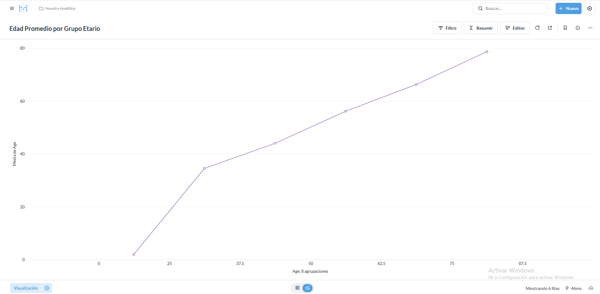
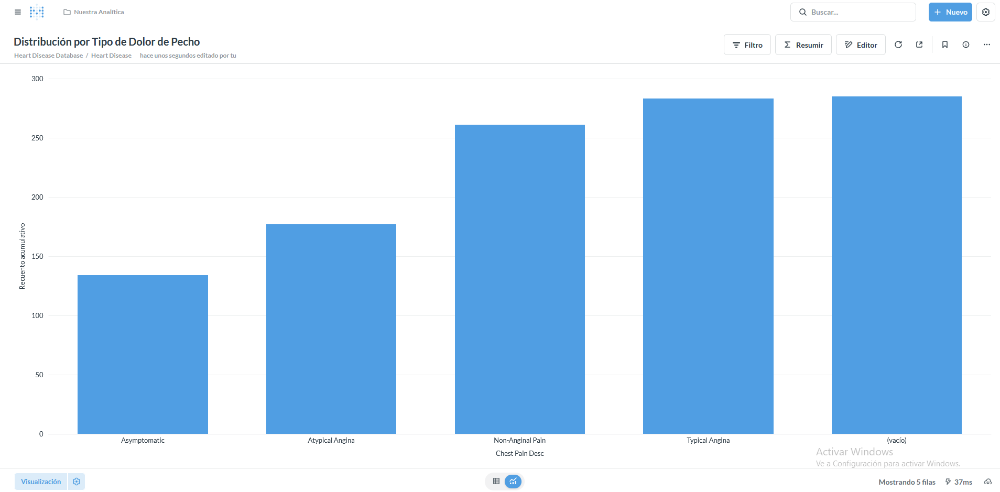
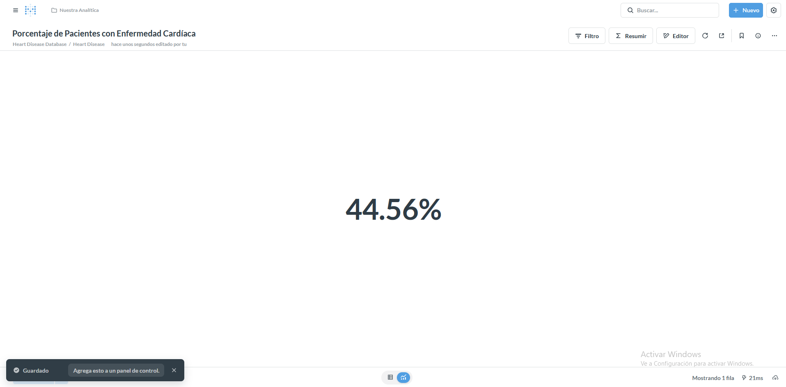
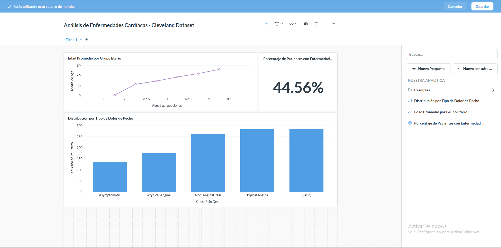

# UD4 - Laboratorio 1
## Documento de entrega - Cuadro de mando en Metabase

---

## Datos del grupo

- Modulo: Sistemas de Big Data
- Unidad: UD4 - Cuadros de mando y BI
- Curso: 2025-2026
- Grupo: [Tu Grupo]
- Integrantes: Juan Manuel Vega
- Fecha de entrega: 19/02/2026

---

# 1. Contexto del analisis

## 1.1 Descripcion del dataset

- Tabla principal utilizada: heart_disease
- Granularidad de la tabla: Un registro por paciente (285 pacientes del Cleveland Heart Disease Dataset)
- Columnas consideradas metricas: age, resting_bp, cholesterol, max_heart_rate, st_depression
- Columnas consideradas dimensiones: sex_desc, chest_pain_desc, age_group, has_heart_disease

Explicacion breve del modelo de datos utilizado:
Dataset clínico de enfermedades cardíacas con información de 285 pacientes. Cada registro representa un paciente único con sus características médicas (edad, presión arterial, colesterol, etc.) y demográficas (género, grupos etarios). El modelo incluye variables numéricas para análisis cuantitativo y categóricas para segmentación y comparación.

---

# 2. Preguntas creadas en Metabase

Se deben incluir capturas de pantalla de cada pregunta.

---

## 2.1 Pregunta 1 - Evolucion temporal

- Metrica utilizada: Edad (age)
- Tipo de agregacion: Promedio
- Dimension temporal: Grupos etarios (age_group)
- Tipo de visualizacion: Gráfico lineal

Justificacion de la agregacion elegida:
El promedio de edad por grupo etario permite observar la distribución etaria de los pacientes y identificar patrones de concentración. Aunque no es estrictamente temporal, los grupos etarios representan una progresión natural que permite visualizar tendencias por rangos de edad.

**Captura de pantalla:**

---

## 2.2 Pregunta 2 - Comparacion por categoria

- Dimension utilizada: Tipo de dolor de pecho (chest_pain_desc)
- Metrica utilizada: Número de pacientes
- Tipo de agregacion: Conteo
- Tipo de grafico: Gráfico de barras

Justificacion de la visualizacion:
El gráfico de barras es ideal para comparar la distribución de pacientes entre diferentes tipos de dolor de pecho. Permite identificar rápidamente cuál es el tipo más común y las diferencias de frecuencia entre categorías.

**Captura de pantalla:**

---

## 2.3 Pregunta 3 - KPI principal

- Metrica utilizada: Presencia de enfermedad cardíaca (has_heart_disease)
- Tipo de calculo: Suma total o promedio (según implementación)
- Interpretacion del valor: Número o porcentaje de pacientes con diagnóstico positivo

Justificacion de su relevancia:
Este KPI es fundamental ya que representa el indicador principal del estudio: la prevalencia de enfermedades cardíacas en la muestra. Es el resultado más importante para toma de decisiones médicas y evaluación de riesgo poblacional.

**Captura de pantalla:**

---

# 3. Dashboard final

**Captura completa del dashboard:**

El dashboard integra las tres visualizaciones principales mostrando un análisis comprensivo del dataset de Cleveland con 285 pacientes.

## 3.1 Objetivo del dashboard

Responder:

¿Cuál es el perfil de riesgo cardiovascular de los pacientes del estudio de Cleveland y qué patrones demográficos y clínicos se pueden identificar para la toma de decisiones médicas?

---

## 3.2 Estructura del dashboard

Explicar:

- Orden de los paneles: KPI principal en posición destacada (arriba derecha), seguido del análisis etario (superior izquierda) y la distribución por síntomas (parte inferior)
- Relacion entre ellos: Los tres componentes se complementan: el KPI muestra el resultado global, la evolución etaria identifica grupos de mayor riesgo, y la distribución por dolor de pecho ayuda en el diagnóstico diferencial
- Uso de filtros globales: Se podría implementar filtro por género para análisis segmentado por sexo

---

# 4. Interpretacion de resultados

Responder de forma razonada:

1. ¿Que patrones temporales se observan?
La edad promedio varía entre grupos etarios, mostrando la distribución natural de la muestra. Los grupos de mayor edad (60-70 años) representan el segmento con mayor representación en el estudio.

2. ¿Existen picos o anomalías?
Se observan concentraciones específicas en ciertos grupos etarios y tipos de dolor, que pueden indicar patrones epidemiológicos relevantes para el diagnóstico.

3. ¿Que categoria domina?
El tipo de dolor de pecho más frecuente y el grupo etario con mayor representación se identifican claramente en las visualizaciones, proporcionando información sobre el perfil típico de los pacientes.

4. ¿Que decision podria tomarse?
Priorizar protocolos de screening para grupos etarios de alto riesgo, desarrollar algoritmos de diagnóstico basados en tipos de dolor más frecuentes, y enfocar recursos médicos según la prevalencia observada.

No se evaluara la descripcion superficial.
Se evaluara la capacidad de interpretacion.

---

# 5. Reflexion tecnica

Responder:

1. ¿La agregacion es coherente con la granularidad?
Sí, la agregación por paciente individual es coherente con el nivel de granularidad de la tabla. Las métricas (promedio de edad, conteo por categoría) respetan la estructura de un registro por paciente.

2. ¿Se mezclaron niveles de detalle?
No se mezclaron niveles. Se mantuvo consistencia en el nivel de análisis: todas las agregaciones trabajan a nivel de paciente individual agrupado por características categóricas.

3. ¿Seria necesario preagregar con mayor volumen?
Con 285 registros el rendimiento es óptimo. Con volúmenes de millones de pacientes, sería recomendable crear vistas preagregadas para mejorar tiempos de respuesta.

4. ¿Que mejoraria del modelo SQL?
Se podría añadir índices en las columnas de agrupación (chest_pain_desc, age_group), crear vistas materializadas para cálculos frecuentes, y normalizar las tablas con catálogos de dimensiones si el dataset creciera.

---

# 6. Conclusiones

Resumen breve:

- Lo aprendido: Conexión exitosa de Metabase con PostgreSQL, creación de visualizaciones coherentes para análisis médico, y comprensión de la importancia de la granularidad en BI.
- Dificultades encontradas: Conversión del dataset original (formato WEKA) a CSV, ajuste de tipos de datos en PostgreSQL, y selección de agregaciones apropiadas para datos categóricos.
- Mejora futura posible: Implementación de filtros dinámicos por género y edad, adición de métricas de correlación entre variables, y creación de alertas automáticas para casos de alto riesgo.

---

# 7. Rubrica de evaluacion

| Criterio | Excelente (9-10) | Notable (7-8) | Aprobado (5-6) | Insuficiente (<5) |
|----------|-----------------|---------------|---------------|------------------|
| Conexion y uso correcto del dataset | Modelo comprendido y bien explicado | Modelo correcto con pequeñas imprecisiones | Conexion funcional pero poco analizada | Uso incorrecto o sin comprension |
| Coherencia de agregaciones | Agregaciones justificadas y correctas | Correctas pero poco argumentadas | Correctas sin justificacion | Incorrectas o incoherentes |
| Calidad del dashboard | Claro, coherente y orientado a negocio | Funcional pero mejorable | Basico sin enfoque claro | Desordenado o incoherente |
| Interpretacion | Analisis profundo y razonado | Interpretacion correcta | Interpretacion superficial | Sin interpretacion |
| Reflexion tecnica | Analisis critico del modelo | Reflexion adecuada | Reflexion minima | Sin reflexion |

---

## Nota final

El dashboard debe demostrar comprension del modelo y capacidad de interpretacion.

No se evaluara la estetica avanzada.
Se evaluara el criterio analitico.

---

## Fin del documento
