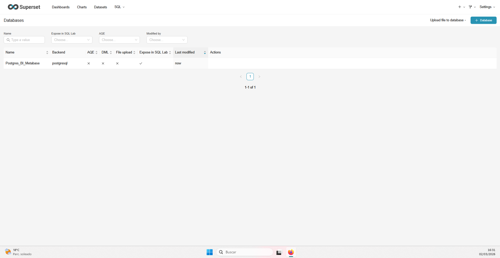
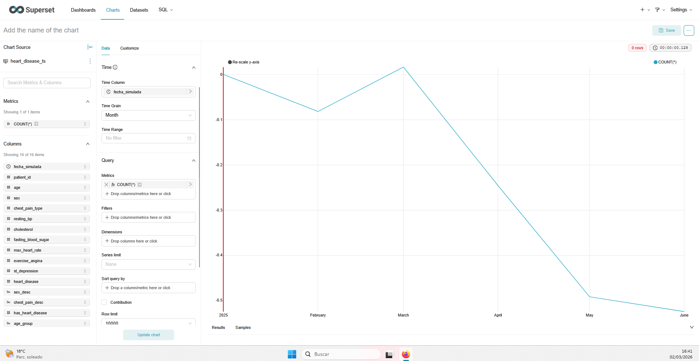
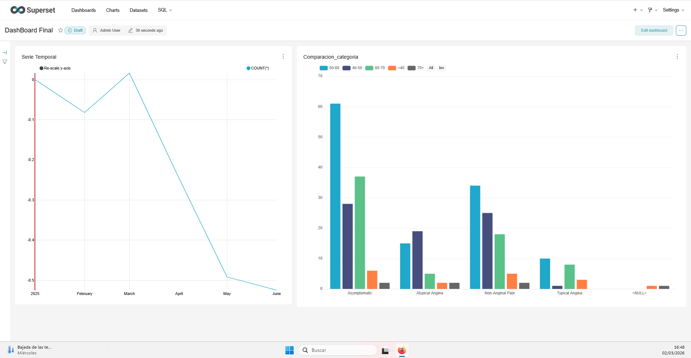

# Guía rápida para completar `UD4_Lab2_Superset_Entrega.md`

## 0) Estado del entorno
- Superset levantado en `http://localhost:8088`
- Usuario: ``
- Password: `admin`
- Carpeta de capturas: `SuperSet/capturas/`

## 1) Conectar la base de datos (sección 3)
1. Entrar en Superset.
2. Ir a **Settings > Database Connections > + Database**.
3. Elegir tu motor (PostgreSQL/MySQL, el mismo que usaste en Metabase).
4. Rellenar host, puerto, db, usuario, contraseña.
5. Pulsar **Test Connection** y guardar cuando salga **Successful**.

Guardar captura como:
- `SuperSet/capturas/01_conexion_successful.png`

## 2) Crear dataset (sección 2)
1. Ir a **Data > Datasets > + Dataset**.
2. Seleccionar database, schema y tabla/vista.
3. Guardar.

Anotar para el MD:
- Nombre base de datos
- Tabla/vista
- Qué representa cada fila (granularidad)

## 3) Visualización 1 - Serie temporal (sección 4)
1. Ir a **Charts > + Chart**.
2. Elegir dataset.
3. Elegir tipo **Time-series Line Chart** (o similar temporal).
4. Configurar:
   - Time column
   - Metric (SUM/COUNT/AVG)
   - Time grain (día/mes)
   - Time range
5. Ejecutar y guardar chart.

Guardar captura como:
- `SuperSet/capturas/02_serie_temporal.png`

## 4) Visualización 2 - Comparación por categoría (sección 5)
1. Crear nuevo chart sobre el mismo dataset.
2. Tipo recomendado: **Bar Chart**.
3. Configurar:
   - Dimension: categoría
   - Metric: SUM/COUNT/AVG
   - Sort by metric DESC
4. Ejecutar y guardar chart.

Guardar captura como:
- `SuperSet/capturas/03_comparacion_categoria.png`

## 5) Dashboard final (sección 6)
1. Ir a **Dashboards > + Dashboard**.
2. Añadir ambos charts.
3. Orden recomendado: primero temporal, después categórico.
4. Guardar.

Guardar captura como:
- `SuperSet/capturas/04_dashboard_final.png`

## 6) Insertar capturas en el MD
Puedes usar:

```md




```

## 7) Secciones que debes redactar sí o sí
- Sección 7: 5 respuestas (mín. 6-8 líneas cada una).
- Sección 8: reflexión técnica con argumentos.
- Sección 9: conclusión (10-15 líneas).

## 8) Comandos útiles
Desde `SuperSet/superset-lab`:

```powershell
docker compose ps
```

```powershell
docker compose logs -f superset
```

```powershell
docker compose down
```
