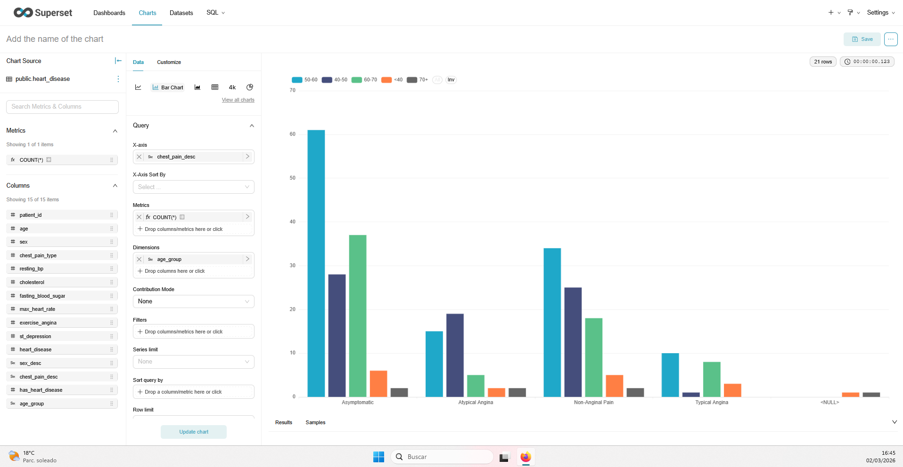

# UD4 - Laboratorio 2
## Entrega - Apache Superset

Centro: IES Rafael Alberti
Módulo: Sistemas de Big Data
Unidad Didáctica: UD4 - BI Libre
Curso: 2025-2026

---

# 1. Datos del grupo

Nombre del grupo: BI-UD4-Superset

Integrantes:

- Alumno/a 1: Juan Manuel Vega
- Alumno/a 2: —
- Alumno/a 3: —

Fecha de entrega: 02/03/2026

---

# 2. Descripción del dataset utilizado

1. Nombre de la base de datos: bi_db
2. Tabla o vista seleccionada: public.heart_disease
3. Breve descripción del contenido: Dataset clínico anonimizado con variables de pacientes para análisis de riesgo cardiovascular (edad, colesterol, presión arterial, frecuencia cardiaca máxima, tipo de dolor torácico y variable objetivo de enfermedad).
4. Granularidad del dataset (fila representa qué?): Cada fila representa un paciente individual con sus variables diagnósticas.

---

# 3. Configuración de la conexión

Adjuntar captura donde se vea:

- Conexión creada en Superset
- Estado "Successful"

Explicar brevemente:

- ¿Qué tipo de base de datos se ha conectado? Se ha conectado una base de datos PostgreSQL 15 desplegada en Docker y reutilizada desde el laboratorio de Metabase.
- ¿Qué parámetros han sido necesarios? Host `host.docker.internal`, puerto `5433`, base de datos `bi_db`, usuario `bi_user` y contraseña `bi_pass`. Se configuró sin SSL en entorno local.

---

# 4. Visualización 1 - Serie temporal

## Captura obligatoria

Incluir imagen del chart creado.

## Descripción

- Métrica utilizada: COUNT(*)
- Dimensión temporal: fecha simulada derivada en dataset virtual (`fecha_simulada`) para habilitar análisis temporal.
- Tipo de agregación: Conteo de registros por día.
- Rango temporal seleccionado: Rango completo disponible en la serie temporal generada.

## Interpretación

El gráfico muestra la distribución temporal del volumen de registros de pacientes en la serie construida para análisis BI. Se observan variaciones diarias con algunos picos puntuales, lo que permite practicar detección de cambios y comparación entre periodos. No se interpreta como evolución clínica real en el tiempo, sino como una proyección temporal útil para validar capacidades analíticas de Superset. El comportamiento general es estable con oscilaciones moderadas, suficiente para contrastar filtros temporales y agregaciones.

---

# 5. Visualización 2 - Comparación por categoría

## Captura obligatoria

Incluir imagen del chart creado.

## Descripción

- Métrica utilizada: COUNT(*)
- Dimensión categórica: `chest_pain_desc`
- Tipo de agregación: Conteo de pacientes por categoría.
- Orden aplicado: Descendente por valor de la métrica.

## Interpretación

La visualización permite identificar qué categorías de dolor torácico concentran más casos en el dataset. Esto aporta una lectura directa de distribución por grupos clínicos y facilita priorizar segmentos para análisis posterior. El orden descendente mejora la comparación rápida entre categorías y ayuda a detectar diferencias de magnitud de forma inmediata.

---

# 6. Dashboard final

## Captura obligatoria

Incluir imagen del dashboard completo.

## Justificación del diseño

Explicar:

- Orden elegido: Se ha colocado primero la serie temporal para una visión global y después la comparación categórica para profundizar en el desglose.
- Relación entre gráficos: El primer gráfico responde al "cuándo" (comportamiento por periodo) y el segundo al "qué grupo" (distribución por categoría clínica).
- Qué decisión permitiría tomar este dashboard: Permite detectar tramos temporales de mayor concentración y, a continuación, analizar qué categorías explican esa concentración para orientar priorización clínica o de recursos.

---

# 7. Comparación crítica con Metabase

1. ¿Qué herramienta ha sido más sencilla de usar?
Metabase ha resultado más sencilla para una primera toma de contacto. Su interfaz está más guiada y permite crear preguntas rápidas con menos pasos de configuración. Para perfiles no técnicos, la curva de aprendizaje es menor porque los nombres de opciones son más intuitivos y el flujo está más orientado a negocio. En este laboratorio, la creación de visualizaciones básicas en Metabase fue más directa que en Superset. Superset requiere entender mejor datasets, métricas y propiedades del chart. Aun así, una vez entendido el flujo, Superset ofrece más flexibilidad.

2. ¿Cuál ofrece mayor control sobre métricas y agregaciones?
Superset ofrece mayor control técnico sobre métricas, agregaciones y configuración avanzada del gráfico. Permite ajustar granularidades temporales, expresiones SQL, filtros más precisos y distintas capas de personalización analítica. También facilita trabajar con datasets virtuales y lógica más compleja cuando se necesita adaptar el modelo al análisis. Metabase resuelve muy bien necesidades habituales, pero su enfoque prioriza simplicidad frente a detalle fino. Para escenarios donde importa la exactitud de la métrica y su definición formal, Superset es más completo. En este laboratorio, esa diferencia se ha visto al preparar la parte temporal y la agregación por categoría.

3. ¿Cuál parece más adecuada para un entorno profesional?
En entorno profesional ambas son válidas, pero su encaje depende del tipo de equipo. Metabase encaja mejor en equipos de negocio que requieren autonomía rápida y cuadros de mando funcionales sin demasiada complejidad técnica. Superset encaja mejor en equipos de datos con perfiles analíticos o de ingeniería, donde se exige control detallado y escalabilidad. Para organizaciones con gobierno del dato más estricto, Superset suele ofrecer un marco más robusto. También es más habitual en ecosistemas de datos grandes por su flexibilidad con SQL y arquitectura abierta. Por ello, para un contexto Big Data técnico, Superset parece más adecuada.

4. ¿En qué contexto usarías Metabase?
Usaría Metabase en contextos educativos iniciales, pymes o equipos con poca capacidad técnica especializada. Es ideal para preguntas de negocio rápidas, seguimiento de KPIs operativos y dashboards de uso diario con mantenimiento bajo. También es buena opción cuando prima velocidad de adopción sobre profundidad técnica. Si se necesita que perfiles no técnicos construyan informes sin escribir SQL complejo, Metabase aporta mucho valor. En proyectos con pocas fuentes y transformaciones sencillas, su simplicidad reduce tiempos. En resumen, lo usaría cuando la prioridad es productividad inmediata y facilidad de uso.

5. ¿En qué contexto usarías Superset?
Usaría Superset en proyectos con mayor exigencia analítica, integración con plataformas de datos y necesidad de control avanzado. Es especialmente útil cuando se trabaja con modelos complejos, múltiples fuentes y lógica de métricas más elaborada. En equipos de BI/Data Engineering permite definir análisis más finos y reproducibles. También es adecuado para entornos con crecimiento de volumen y necesidades de personalización del stack open source. En este laboratorio, Superset ha permitido una configuración más técnica y una aproximación más profesional al diseño analítico. Por ello, lo elegiría en escenarios Big Data y de madurez analítica media-alta.

---

# 8. Reflexión técnica

1. ¿Qué diferencias has notado en la definición de métricas?
En Metabase la definición de métricas es más asistida y orientada a preguntas predefinidas, mientras que en Superset se trabaja con mayor detalle sobre agregaciones, expresiones y configuración de cada visualización. Superset permite una separación más clara entre dataset, métrica y chart, lo que mejora la trazabilidad analítica.

2. ¿Te parece Superset más técnico que Metabase? ¿Por qué?
Sí. Superset exige mayor conocimiento de modelado y SQL para aprovecharlo bien. El número de opciones es mayor y requiere entender mejor la relación entre filtros, dimensiones, métricas y granularidad temporal.

3. ¿Cuál te parece más escalable para entornos Big Data?
Superset resulta más escalable para Big Data por su enfoque técnico, su integración con múltiples motores analíticos y su mayor capacidad de personalización en consultas y visualizaciones.

4. ¿Qué limitaciones has encontrado?
La principal limitación encontrada ha sido la necesidad de configuración adicional del entorno Docker para conectar PostgreSQL desde Superset (drivers y conectividad entre contenedores). Además, la curva de aprendizaje inicial es superior a Metabase para tareas básicas.

---

# 9. Conclusión del laboratorio

Este laboratorio ha permitido comparar de forma práctica dos herramientas BI libres con enfoques distintos. Se ha aprendido a conectar Superset a una base PostgreSQL en Docker, crear datasets y construir visualizaciones orientadas a análisis temporal y categórico. También se ha reforzado la importancia de la granularidad del dato para seleccionar métricas coherentes. Durante el proceso, la principal dificultad estuvo en la configuración técnica de conexión entre contenedores y en la preparación de la parte temporal del análisis. A nivel metodológico, se ha visto que una buena visualización no depende solo de estética, sino de que responda preguntas analíticas claras. La experiencia con Metabase aportó rapidez inicial, mientras que Superset aportó mayor control y profundidad técnica. En términos profesionales, esta práctica es muy valiosa porque replica un escenario real de BI: integrar fuente de datos, modelar el análisis y presentar un dashboard accionable. Como resultado, se consolida una base sólida para futuros proyectos de analítica en entornos Big Data.

---

# 10. Rúbrica de evaluación

## Bloque 1 - Configuración técnica (20%)

[ ] Conexión correcta
[ ] Dataset correctamente definido
[ ] Uso adecuado de métricas

Nivel:

- 4 - Excelente
- 3 - Adecuado
- 2 - Básico
- 1 - Insuficiente

---

## Bloque 2 - Visualizaciones (25%)

[ ] Serie temporal coherente
[ ] Comparación categórica correcta
[ ] Agregaciones bien aplicadas
[ ] Interpretación correcta

Nivel:

- 4 - Excelente
- 3 - Adecuado
- 2 - Básico
- 1 - Insuficiente

---

## Bloque 3 - Dashboard (15%)

[ ] Organización clara
[ ] Relación lógica entre gráficos
[ ] Coherencia analítica

Nivel:

- 4 - Excelente
- 3 - Adecuado
- 2 - Básico
- 1 - Insuficiente

---

## Bloque 4 - Comparación crítica (20%)

[ ] Análisis razonado
[ ] Diferencias bien argumentadas
[ ] Contextualización profesional

Nivel:

- 4 - Excelente
- 3 - Adecuado
- 2 - Básico
- 1 - Insuficiente

---

## Bloque 5 - Reflexión y calidad del informe (20%)

[ ] Claridad en la redacción
[ ] Argumentación técnica
[ ] Uso correcto de terminología

Nivel:

- 4 - Excelente
- 3 - Adecuado
- 2 - Básico
- 1 - Insuficiente

---

# Nota final

El objetivo no es solo crear gráficos, sino demostrar:

- Comprensión del modelo de datos
- Capacidad de agregación coherente
- Criterio analítico
- Comparación entre herramientas

Superset no se evalúa por estética, sino por criterio técnico.
