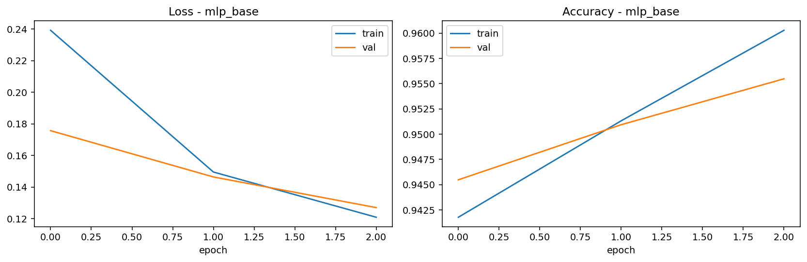
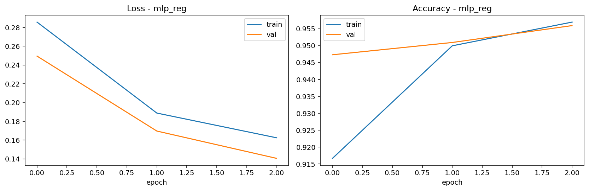

# Informe técnico — Clasificación ANN

## 0. Datos del alumno

- Nombre y apellidos: Juan Manuel Vega Carrillo
- Grupo:Big Data e IA
- Fecha: 04/03/2026

## 1. Dataset

- Fuente: Our World in Data (OWID), COVID-19 dataset (descarga automática desde URL oficial / mirror GitHub).
- Variable objetivo: `target` binaria construida como `new_deaths_per_million >= 1.0`.
- Variables seleccionadas: `location`, `continent`, `new_cases_per_million`, `total_cases_per_million`, `reproduction_rate`, `icu_patients_per_million`, `hosp_patients_per_million`, `people_vaccinated_per_hundred`, `stringency_index`, `population_density`, `median_age`, `aged_65_older`, `cardiovasc_death_rate`, `diabetes_prevalence`, `gdp_per_capita`.
- Justificación de selección: se incluyen variables epidemiológicas, de presión hospitalaria, vacunación, políticas públicas y factores demográficos/socioeconómicos que pueden afectar la severidad y mortalidad.

## 2. Preprocesamiento

- Limpieza aplicada: eliminación de duplicados y exclusión de agregados OWID (`iso_code` que empieza por `OWID_`).
- Tratamiento de nulos: imputación por mediana en numéricas y por moda en categóricas.
- Codificación de categóricas: One-Hot Encoding con `handle_unknown='ignore'`.
- Estandarización/normalización: `StandardScaler` en variables numéricas.
- División de datos (70/15/15): estratificada (`train_test_split` en dos etapas).
- Justificación técnica: la estratificación preserva proporción de clases, la imputación evita pérdida excesiva de filas y la estandarización mejora la estabilidad del entrenamiento de la red.

## 3. Arquitectura del modelo ANN

- Capas ocultas: 2 capas densas (`64` y `32` neuronas).
- Activaciones: ReLU en ocultas y Sigmoide en salida.
- Pérdida: Binary Cross Entropy.
- Optimizador: Adam (`learning_rate=1e-3`).
- Número de parámetros:
	- MLP base: 18,305.
	- MLP regularizado: 18,561 (incluye BatchNorm).
- Justificación técnica: arquitectura compacta para clasificación tabular binaria, con capacidad suficiente para capturar no linealidades sin ser excesivamente compleja.

## 4. Regularización

- Técnica aplicada (Dropout/L2/BatchNorm): en el modelo regularizado se aplicó `L2(1e-4)` + `BatchNormalization` + `Dropout(0.30/0.20)`.
- Comparativa sin regularización vs con regularización (test):
	- MLP base: Accuracy `0.9632`, Recall `0.4615`, F1 `0.5970`, AUC `0.9082`.
	- MLP regularizado: Accuracy `0.9591`, Recall `0.3692`, F1 `0.5161`, AUC `0.9125`.
- Conclusión: la regularización mejoró ligeramente AUC y especificidad, pero redujo recall y F1 en esta ejecución; no siempre mejora todas las métricas a la vez.

## 5. Evaluación (validación y test)

Resultados obtenidos (archivo `metrics_summary.csv`):

| Modelo | Split | Accuracy | Recall | Specificity | F1 | AUC-ROC | TN | FP | FN | TP |
|---|---|---:|---:|---:|---:|---:|---:|---:|---:|---:|
| MLP base | val  | 0.9555 | 0.3817 | 0.9918 | 0.5051 | 0.9205 | 2053 | 17 | 81 | 50 |
| MLP base | test | 0.9632 | 0.4615 | 0.9947 | 0.5970 | 0.9082 | 2060 | 11 | 70 | 60 |
| MLP reg  | val  | 0.9559 | 0.3588 | 0.9937 | 0.4921 | 0.9254 | 2057 | 13 | 84 | 47 |
| MLP reg  | test | 0.9591 | 0.3692 | 0.9961 | 0.5161 | 0.9125 | 2063 | 8  | 82 | 48 |
| LogReg   | val  | 0.9505 | 0.1832 | 0.9990 | 0.3057 | 0.8658 | 2068 | 2  | 107| 24 |
| LogReg   | test | 0.9482 | 0.1538 | 0.9981 | 0.2597 | 0.8606 | 2067 | 4  | 110| 20 |

## 6. Comparativa con modelo clásico

- Modelo clásico usado: Regresión logística.
- Resultados comparados: la MLP (base y regularizada) supera claramente a logística en recall, F1 y AUC, manteniendo accuracy alta.
- Interpretación: la red neuronal captura relaciones no lineales del problema que la regresión logística lineal no modela tan bien.

## 7. TensorBoard

Inserta capturas de:

1. Evolución de la pérdida
2. Evolución de accuracy
3. Entrenamiento vs validación
4. Comparación de hiperparámetros (si aplica)

### 7.1 Evolución de la pérdida (MLP base)

### 7.2 Evolución de accuracy (MLP regularizado)

### 7.3 Entrenamiento vs validación

En ambas figuras anteriores se muestran las curvas de entrenamiento (`train`) y validación (`val`) para pérdida y accuracy.

### 7.4 Comparación de hiperparámetros (si aplica)

La comparación se realiza entre dos configuraciones del modelo:

- `mlp_base` (sin regularización)
- `mlp_reg` (con `L2 + BatchNormalization + Dropout`)

Rutas usadas:

- `../ann_results/graficas/history_mlp_base.png`
- `../ann_results/graficas/history_mlp_reg.png`
- `../ann_results/tensorboard/` (logs para visualización en TensorBoard)

## 8. Respuestas críticas

1. ¿Qué variables seleccionaste y por qué?

Se seleccionaron variables que cubren dinámica de contagio (`new_cases_per_million`, `reproduction_rate`), presión asistencial (`icu_patients_per_million`, `hosp_patients_per_million`), vacunación (`people_vaccinated_per_hundred`), restricciones (`stringency_index`) y vulnerabilidad poblacional (`aged_65_older`, `diabetes_prevalence`, etc.). El objetivo es representar múltiples dimensiones del riesgo.

2. ¿Cómo diseñaste la arquitectura?

Se eligió una MLP de 2 capas ocultas (64-32) por equilibrio entre capacidad y simplicidad en datos tabulares. Se comparó una versión base frente a otra regularizada para estudiar generalización.

3. ¿Existe sobreajuste o subajuste?

No se observa sobreajuste severo en esta prueba corta (3 épocas), pero para una conclusión fuerte conviene entrenar más épocas y revisar curvas completas en TensorBoard.

4. ¿Cómo afectó la regularización?

Aumentó ligeramente AUC y especificidad, pero redujo recall/F1 en test. Esto sugiere una frontera más conservadora (menos falsos positivos, más falsos negativos).

5. ¿Qué hiperparámetro tuvo mayor impacto?

En este escenario, el umbral de definición del target (`new_deaths_per_million`) y los parámetros de regularización (dropout/L2) impactan mucho en recall/F1 y en el balance sensibilidad-especificidad.

6. ¿Qué mejorarías?

Validación temporal por fecha (time-aware split), ajuste de umbral de decisión distinto de 0.5, búsqueda sistemática de hiperparámetros, balanceo de clases y comparación con modelos de boosting (XGBoost/LightGBM) como referencia adicional.

## 9. Conclusión final

El pipeline cumple los requisitos técnicos de la actividad: preprocesamiento completo, MLP con y sin regularización, métricas obligatorias, baseline clásico y soporte TensorBoard. La MLP supera a la regresión logística en calidad global (AUC/F1/recall), aunque el recall sigue siendo moderado y merece optimización. Como mejoras, se propone ajuste de umbral, tuning más amplio, validación temporal y análisis de equilibrio entre sensibilidad y especificidad según objetivo clínico.
