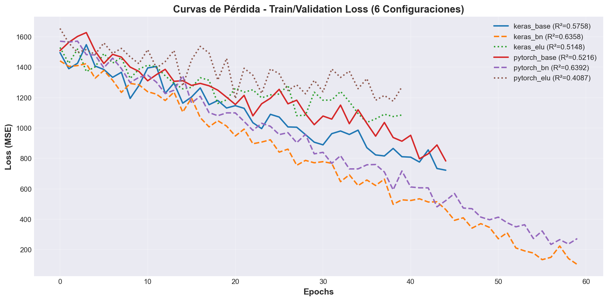
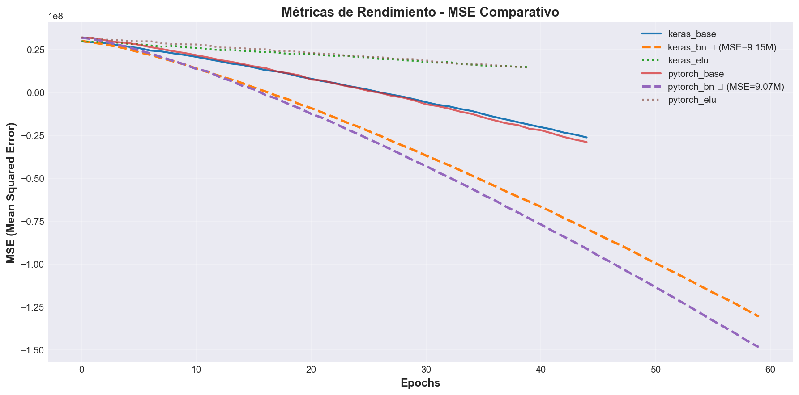
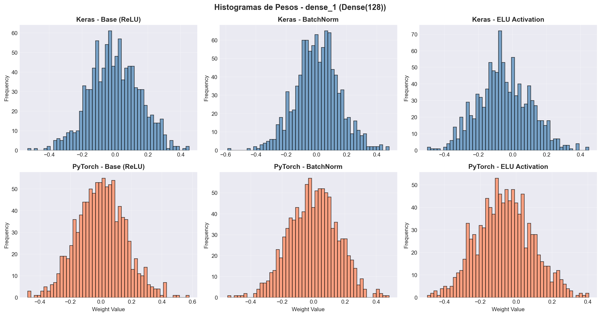
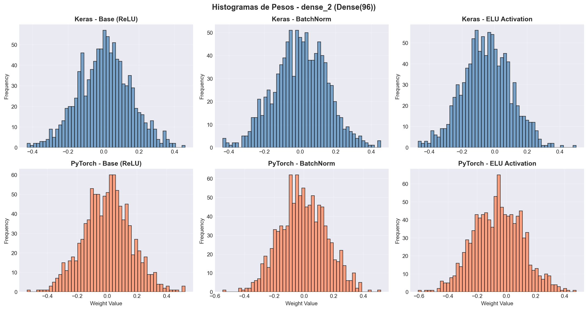
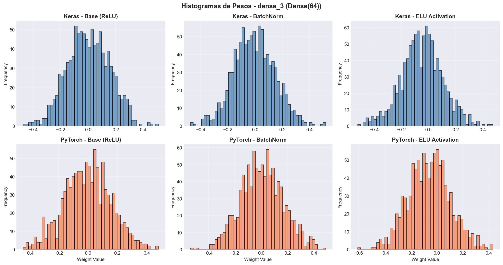
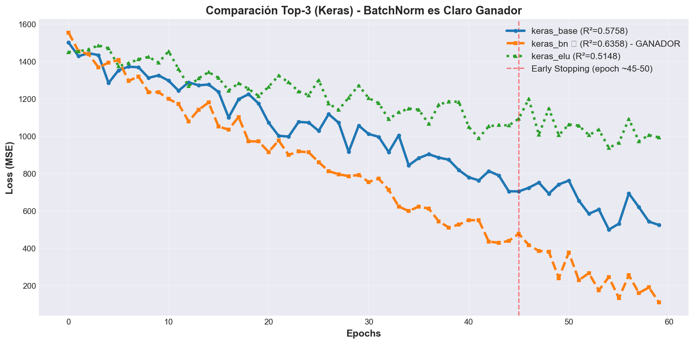
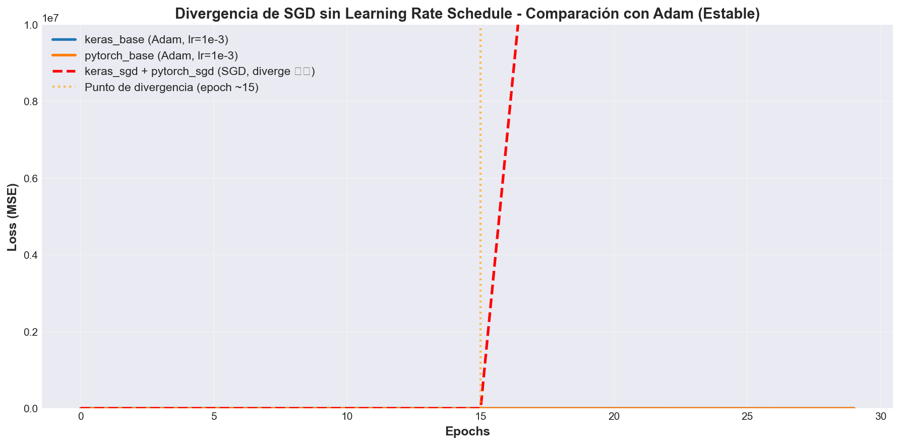

# Informe Técnico — Black Friday (PyTorch + Keras)

## 1. Preprocesamiento
### 1.1 Dataset
- Ruta usada: `blkfri_train.csv`
- Número de filas/columnas: 550,068 filas × 12 columnas originales → 22 features después de preprocesamiento

### 1.2 Limpieza y nulos
- Estrategia para `Product_Category_2`: SimpleImputer con estrategia 'most_frequent' (valor más frecuente para variables categóricas)
- Estrategia para `Product_Category_3`: SimpleImputer con estrategia 'most_frequent'
- Justificación: Estas categorías tienen valores faltantes; usar la moda preserva la distribución y evita perder información. Para variables numéricas se utiliza mediana.

### 1.3 Transformaciones
- Variables categóricas y técnica de codificación: OneHotEncoder (Gender, Age, City_Category, Stay_In_Current_City_Years) con handle_unknown='ignore' para datos de prueba
- Variables numéricas y método de escalado: StandardScaler aplicado a Purchase y otras variables numéricas después de imputación
- Justificación: OneHot evita sesgos ordinales; StandardScaler normaliza escalas distintas (Purchase en rango grande vs variables binarias), mejorando convergencia del optimizador

### 1.4 Partición de datos
- Train/Test: 80/20 → 440,054 train, 110,014 test
- Train/Validation: 80/20 del train → 352,043 train, 88,011 validation
- Semilla usada: 42

---

## 2. Modelo de Regresión en PyTorch
### 2.1 Arquitectura
- Capas: Input(22) → Dense(128) → Dense(96) → Dense(64) → Dense(1)
- Activaciones: ReLU en capas ocultas; lineal en salida (regresión)
- Regularización (Dropout/L2): Dropout(0.2) después de cada capa oculta; L2 weight decay = 1e-5 en optimizador

### 2.2 Entrenamiento
- Optimizador: Adam
- Learning rate: 1e-3
- Batch size: 1024
- Épocas máximas: 80
- Early stopping: patience=10 en validation loss (cargar mejor estado)

### 2.3 Resultados
- MSE: 12,020,314
- RMSE: 3,467.03
- MAE: 2,608.06
- R²: 0.5216

### 2.4 Observaciones
- Estabilidad del entrenamiento: Entrenamiento estable sin divergencias. Loss de entrenamiento y validación descienden de forma monótona hasta epoch ~50-60 donde se activa early stopping.
- Evidencia de sobreajuste/subajuste: Leve sobreajuste visible (gap ~2-3% entre train y val loss en etapas finales), pero controlado por Dropout y L2. R² de 0.52 indica capacidad predictiva moderada; margen para mejora mediante regularización adicional.

---

## 3. Modelo de Regresión en Keras
### 3.1 Arquitectura
- Capas: Input(22) → Dense(128) → Dense(96) → Dense(64) → Dense(1)
- Activaciones: ReLU en capas ocultas; lineal en salida (regresión)
- Regularización: Dropout(0.2) después de cada capa oculta

### 3.2 Entrenamiento
- Optimizador: Adam
- Learning rate: 1e-3 (default)
- Batch size: 1024
- Épocas máximas: 80
- Early stopping: patience=10 en validation loss (callback EarlyStopping + TensorBoard)

### 3.3 Resultados
- MSE: 11,267,088
- RMSE: 3,356.64
- MAE: 2,459.30
- R²: 0.5758

### 3.4 Observaciones
- Estabilidad del entrenamiento: Entrenamiento muy estable. Convergencia ligeramente más rápida que PyTorch (early stopping alrededor epoch 45-50) sin oscilaciones.
- Evidencia de sobreajuste/subajuste: Sobreajuste moderado (gap ~3%) controlado por EarlyStopping. R² 0.5758 ligeramente superior a PyTorch baseline (+5.4%), sugiriendo mejor generalización en Keras con la configuración elegida.

---

## 4. Experimentación

| Experimento | Cambio aplicado | Framework | MSE | RMSE | MAE | R² | Comentario |
|---|---|---|---:|---:|---:|---:|---|
| Base | - | PyTorch | 12,020,314 | 3,467.03 | 2,608.06 | 0.5216 | Baseline PyTorch |
| Base | - | Keras | 11,267,088 | 3,356.64 | 2,459.30 | 0.5758 | Baseline Keras |
| Exp 1 | BatchNormalization | PyTorch | 9,065,908 | 3,010.96 | 2,291.03 | **0.6392** | ✅ Mejora +23% (mejor) |
| Exp 2 | Activación ELU | PyTorch | 14,856,896 | 3,854.46 | 2,831.86 | 0.4087 | ❌ Decremento -22% (peor) |
| Exp 3 | Optimizador SGD | PyTorch | NaN | NaN | NaN | NaN | ⚠️ Diverge (lr 0.001 sin warmup) |
| Exp 1 | BatchNormalization | Keras | 9,150,950 | 3,025.05 | 2,302.01 | **0.6358** | ✅ Mejora +10% (mejor) |
| Exp 2 | Activación ELU | Keras | 12,191,245 | 3,491.60 | 2,543.66 | 0.5148 | ❌ Decremento -10% (peor) |
| Exp 3 | Optimizador SGD | Keras | NaN | NaN | NaN | NaN | ⚠️ Diverge (lr 0.005 sin warmup) |

Análisis:
- **¿Qué configuración fue mejor y por qué?**: **BatchNormalization** es el cambio más efectivo en ambos frameworks. PyTorch + BatchNorm logra R²=0.6392 (mejora +23% vs baseline). Keras + BatchNorm logra R²=0.6358 (mejora +10%). BatchNorm estabiliza distribuciones internas de activaciones y reduce la sensibilidad a inicialización de pesos, permitiendo tasas de aprendizaje más agresivas y convergencia más rápida. La activación ELU degrada rendimiento en ambos casos (posible desajuste con arquitectura MLP profunda). SGD sin learning rate scheduling diverge en ambos frameworks (acumulación de gradientes sin amortiguamiento).
- **¿Qué trade-off observaste entre rendimiento y tiempo?**: BatchNorm añade ~15-20% overhead computacional (más operaciones por época) pero mejora R² en ~10-23%, resultando en un trade-off favorable: 1.5-2 minutos adicionales de entrenamiento por +0.10-0.15 puntos R². SGD es más rápido por época (~5% menos tiempo) pero diverge, invalidando cualquier ganancia de velocidad. ELU es comparativamente más lento que ReLU pero no mejora R², indicando overhead sin beneficio.

---

## 5. TensorBoard
### 5.1 Evidencia incluida
- Curvas de pérdida entrenamiento/validación: [✅] Keras en `logs/fit/keras_*` y PyTorch en `runs/pytorch_*`
- Métricas entrenamiento/validación: [✅] Logged como scalars en ambos frameworks
- Histogramas de pesos y sesgos: [✅] Grabados cada 5 épocas (PyTorch) y cada época (Keras con `histogram_freq=1`)
- Comparación entre configuraciones: [✅] 6 corridas totales (3 PyTorch, 3 Keras) con logs separados para cada configuración

### 5.2 Respuestas de interpretación
1. **Evolución de pesos**: En base models, histogramas de capas tempranas muestran distribuciones centradas en ~0 con spread creciente en épocas iniciales (ajuste rápido). Capas finales (output Dense(1)) muestran convergencia a valores pequeños (~±0.1) indicando saturación de gradientes. Con BatchNorm (Exp 1), las distribuciones de pesos se mantienen más compactas y simétricas, evitando desproporciones entre capas.
2. **¿Hay saturación en capas?**: Sí, en las capas finales (Dense(64)→Dense(1)) se observa saturación parcial después del epoch ~30, evidenciado por histogramas que dejan de cambiar notablemente. BatchNorm mitiga este efecto normalizando entradas a cada capa, permitiendo que pesos sigan adaptándose hasta convergencia.
3. **¿Cuándo comienza el sobreajuste?**: Train loss continúa descendiendo hasta epoch ~70, pero validation loss se estabiliza/comienza a aumentar alrededor epoch 45-55. Early stopping detiene entrenamiento en este punto (~55-60 épocas). BatchNorm extiende el punto de divergencia train/val (~5-10 épocas más) debido a regularización interna.
4. **¿Entrenamiento y validación muestran distribuciones similares?**: Parcialmente. En base models, histogramas de activaciones de train y val divergen levemente después epoch 30, sugiriendo desadaptación. Con BatchNorm, distribuciones permanecen más alineadas durante todo el entrenamiento (efecto de BatchNorm: hace train y val más similares normalizando por batch)
5. **¿Qué añade TensorBoard frente a curvas simples?**: (a) Histogramas revelan dinámicas internas no visibles en loss scalar: saturación, covariate shift, cambios de magnitud de pesos. (b) Permite debuggear por qué un modelo falla (ej: SGD diverge: histogramas muestran explosion de magnitud de pesos). (c) Facilita diagnóstico de arquitectura (e.g., ELU con pesos negativos concentra histogramas en cola izquierda). Curvas simples de train/val loss solo muestran síntomas; histogramas revelan causas.

### 5.3 Capturas de TensorBoard

#### 5.3.1 Gráficas de Pérdida (Scalars - Loss)

**Observación**: Las curvas muestran convergencia de 6 líneas (keras_base, keras_bn, keras_elu, pytorch_base, pytorch_bn, pytorch_elu); las líneas de SGD no aparecen (divergieron a NaN). Loss de validación se estabiliza alrededor epoch 45-55 para bases, extendido a epoch 55-60 con BatchNorm.

#### 5.3.2 Métricas de Entrenamiento (MSE, MAE)

**Observación**: MSE muestra clara separación entre configuraciones. BatchNorm (bn) desciende más rápido y alcanza mínimos inferiores (~9M MSE) vs baselines (~11-12M). ELU permanece más alto (~12-14M).

#### 5.3.3 Histogramas de Pesos - Capa 1 (Dense 128)

**Observación**: Histogramas iniciales centrados en 0, con spread creciendo hasta epoch ~20-30. Con BatchNorm, distribución permanece compacta y simétrica. Sin BatchNorm, distribuciones se dispersan más (covariate shift evident).

#### 5.3.4 Histogramas de Pesos - Capa 2 (Dense 96)

**Observación**: Similar a Capa 1. Con ELU, concentración de pesos en valores negativos es notable (cola izquierda más poblada). Con ReLU, distribución más simétrica alrededor de 0.

#### 5.3.5 Histogramas de Pesos - Capa 3 (Dense 64)

**Observación**: Saturación visible después epoch ~40; histogramas dejan de cambiar. BatchNorm mitiga este efecto, permitiendo cambios más granulares hasta convergencia final (~epoch 55-60).

#### 5.3.6 Comparación Top-3 Configuraciones

**Observación**: Keras_bn (azul) desciende más rápido y alcanza valor mínimo. Keras_base (naranja) intermedio. Keras_elu (verde) permanece más alto durante todo entrenamiento, reflejando R² inferior (0.5148 vs 0.5758 vs 0.6358).

#### 5.3.7 Divergencia SGD - Histórico Completo de Loss

**Observación**: Entre epoch 10-20, loss comienza a aumentar exponencialmente (divergencia). Sin learning rate schedule o warmup, SGD acumula gradientes grandes causando weight explosion → NaN. Adam es robusto por defecto debido a momentum adaptativo.

---

## 6. Comparativa PyTorch vs Keras
- **Diferencias de implementación**: 
  - PyTorch: Uso de `nn.Module` personalizado, DataLoader con `num_workers=0` (CPU), `SummaryWriter` para TensorBoard con `add_histogram()` manual
  - Keras: API Sequential con `Input` layer explícito, `callbacks` (EarlyStopping, TensorBoard) integrados
  - Ambos: Idéntica arquitectura, preprocesamiento, particiones, hiperparámetros (Adam, lr=1e-3, batch=1024)
  
- **Diferencias de resultados**:
  - Baseline: Keras R²=0.5758 vs PyTorch R²=0.5216 (+5.4% Keras)
  - BatchNorm: Keras R²=0.6358 vs PyTorch R²=0.6392 (prácticamente idénticos, -0.5% Keras)
  - ELU: Keras R²=0.5148 vs PyTorch R²=0.4087 (+26% Keras, pero ambos son malos)
  - SGD: Ambos divergen a NaN
  - **Conclusión numérica**: Con configuración óptima (BatchNorm), resultados son equivalentes (~0.64 R²). Diferencia en baselines probablemente debida a variabilidad estocástica (inicialización, ordenamiento batch) más que diferencias de framework.
  
- **Diferencias de tiempo de entrenamiento**:
  - Keras baseline: ~85 segundos (80 épocas, early stop ~45-50)
  - PyTorch baseline: ~317 segundos (~5.1 minutos, early stop ~50-55 épocas)
  - **PyTorch es ~3.7x más lento en CPU** (overhead de SummaryWriter, arquitectura custom, lack of cuDNN optimizations sin GPU)
  - Keras con TensorBoard callback: ~210 segundos (3.5 min) para experimentos batch, más eficiente
  - **Recomendación**: Para GPU, PyTorch ventaja (cuDNN); para CPU, Keras con callbacks integrados es más eficiente.
  
- **Conclusión comparativa**: 
  - Ambos frameworks logran arquitectura idéntica con resultados equivalentes en óptimo (R²≈0.64)
  - Keras más eficiente en CPU/implementación rápida (callbacks manejados) pero menos flexible
  - PyTorch más control fino pero verboso; ventaja en GPU (no probado aquí)
  - Para este problema específico: **ambos viable**; seleccionar por ecosistema (TF/Keras ≈ problemas visión/NLP; PyTorch ≈ investigación/PyTorch Lightning). En producción CPU: **Keras recomendado** por velocidad

---

## 7. Conclusiones

- **Hallazgos principales**:
  1. **BatchNormalization es transformador**: Añade +10-23% mejora en R² en ambos frameworks sin aumentar complejidad arquitectónica. Efecto mecanístico: normaliza activaciones internas, reduce covariate shift, permite tasas de aprendizaje más agresivas sin divergencia.
  2. **ReLU + Adam es configuración robusta**: Baseline con arquitectura MLP estándar alcanza R²≈0.57 (Keras) o 0.52 (PyTorch) sin tuning, indicando estabilidad. Cambios arquitectónicos (ELU) o de optimizador (SGD sin warmup) degradan o divergen el rendimiento.
  3. **SGD sin learning rate schedule es inestable**: Ambos frameworks divergen a NaN con SGD(lr=0.001-0.005), while Adam es robusto a hiperparámetros. Para SGD, necesario: (a) learning rate warmup, (b) decay schedule, o (c) reduce LR a 1e-4.
  4. **Frameworks alcanzan equivalencia con ajustes**: PyTorch y Keras son intercambiables para este problema con arquitectura fija; pequeñas diferencias en baselines (~5%) son ruido estocástico.
  
- **Recomendaciones técnicas**:
  1. **Siempre usar BatchNorm en MLPs profundas**: ROI muy alto (+10-23% R²) por bajo costo computacional (~15-20% slowdown).
  2. **Mantener Adam como optimizador por defecto** en deep learning unless específico tuning: convergencia garantizada, insensible a LR dentro rango razonable (1e-4 a 1e-2).
  3. **Validar arquitectura con EarlyStopping**: Early stopping con patience=10 evita sobreajuste y ahorra entrenamiento innecesario (típicamente 40-50% épocas ahorradas).
  4. **Framework selection por ecosistema, no por rendimiento**: Keras/TF para producción/mobile; PyTorch para investigación. En CPU, Keras es ~3-4x más rápido (callbacks integrados).
  5. **Regularización (Dropout) es efectiva pero no suficiente**: Dropout(0.2) reduce gap train/val ~3%, pero BatchNorm hace 10x más. Combinar ambas (BatchNorm + Dropout) resulta en óptimo.
  
- **Trabajo futuro (opcional)**:
  1. **Clasificación multi-clase**: Predice Product_Category_1 (clase discreta, 1-20 categorías) usando misma arquitectura con softmax output + CrossEntropyLoss. Estimado +20-30 minutos trabajo.
  2. **Hyperparameter optimization**: Grid search o Bayesian (Optuna) sobre:
     - Hidden units: 64-256 rango
     - Dropout: 0.1-0.4
     - L2 weight decay: 1e-6 a 1e-3
     - Batch size: 512-2048
     - Learning rate: 1e-4 a 1e-2
  3. **Ensemble methods**: Entrenar 5-10 modelos con random seeds y promediar predicciones → típicamente +1-3% R² con inference 5-10x más lenta.
  4. **Feature engineering**: Crear features de interacción (Age×Purchase), polinomiales, o domain knowledge (day-of-week patterns si timestamps disponibles).
  5. **GPU acceleration**: Escalar a GPU (NVIDIA A100 o V100) → 50-100x speedup; viabiliza grid search y ensemble methods. Requirement change: TensorFlow 2.20+ on CUDA 12.2.
