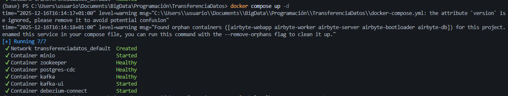
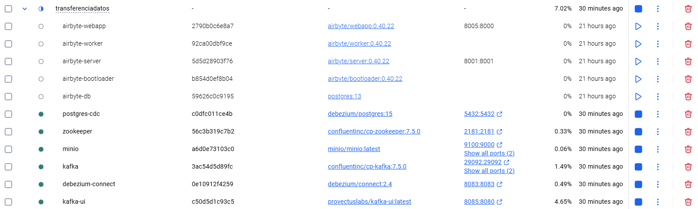
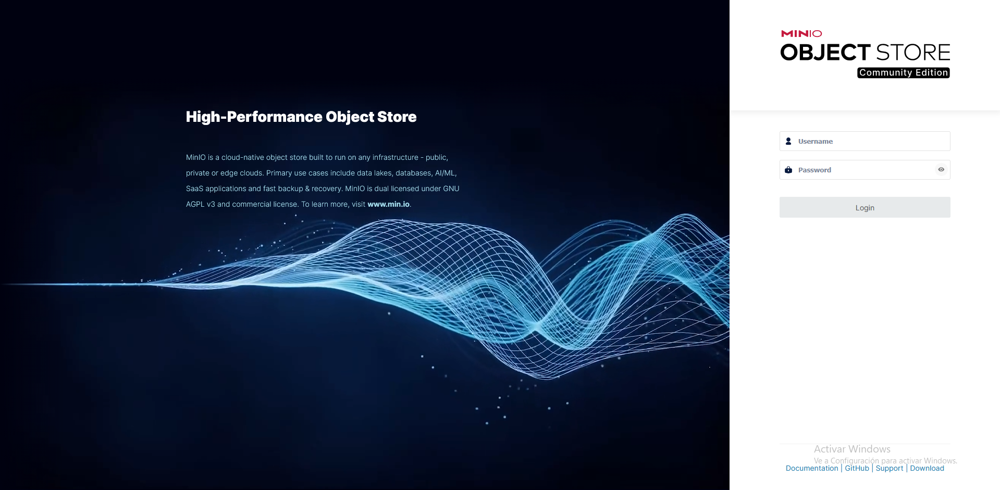
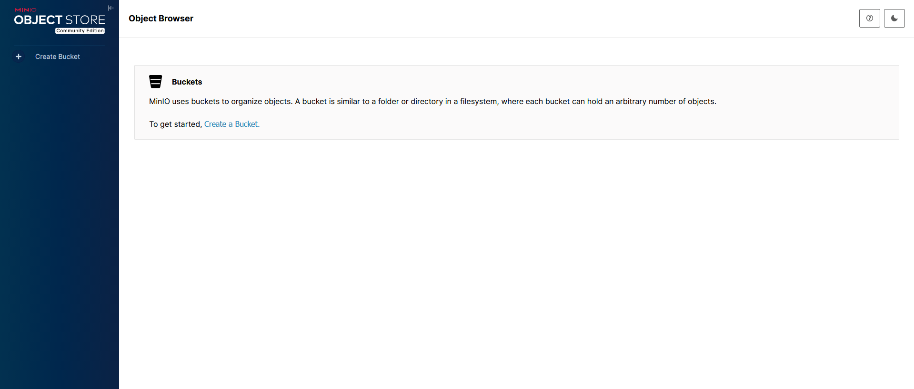
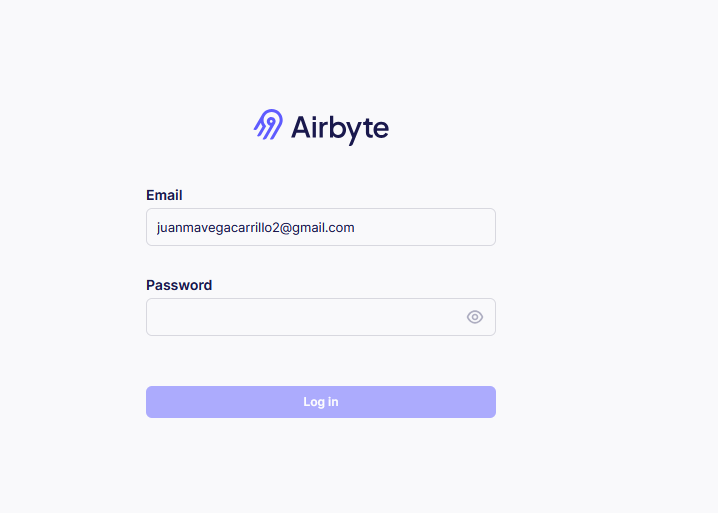
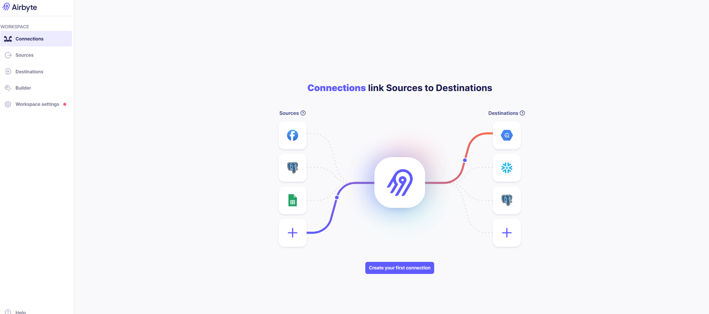
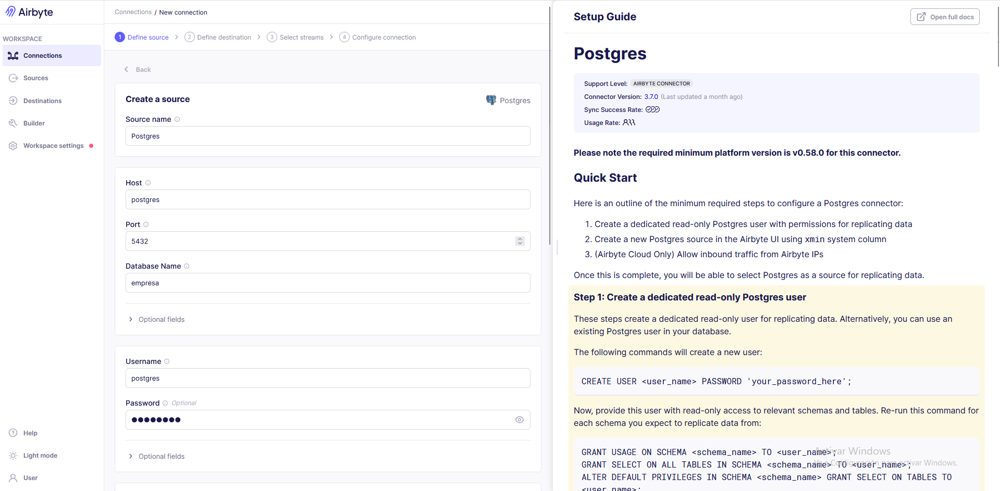

# 🎓 Práctica: Pipeline Moderno de Ingesta e Integración de Datos

**Asignatura:** Sistemas de Big Data  
**Unidad:** UD2 - Almacenamiento de Datos  
**Tema:** Integración y Transferencia de Datos  
**Fecha:** 16 de diciembre de 2025  
**Alumno:** Juan Manuel Vega

---

## 📋 Índice

1. [Objetivo de la práctica](#1-objetivo-de-la-práctica)
2. [Arquitectura del pipeline](#2-arquitectura-del-pipeline)
3. [Tecnologías utilizadas](#3-tecnologías-utilizadas)
4. [Desarrollo de la práctica](#4-desarrollo-de-la-práctica)
   - 4.1 [Despliegue del entorno Docker](#41-despliegue-del-entorno-docker)
   - 4.2 [Configuración de Debezium CDC](#42-configuración-de-debezium-cdc)
   - 4.3 [Visualización de Topics en Kafka](#43-visualización-de-topics-en-kafka)
   - 4.4 [Consumer Python - CDC en tiempo real](#44-consumer-python---cdc-en-tiempo-real)
   - 4.5 [Pruebas CDC: INSERT, UPDATE, DELETE](#45-pruebas-cdc-insert-update-delete)
   - 4.6 [Configuración de MinIO (Data Lake)](#46-configuración-de-minio-data-lake)
   - 4.7 [Configuración de Airbyte](#47-configuración-de-airbyte)
   - 4.8 [Sincronización y resultado final](#48-sincronización-y-resultado-final)
5. [Script del Consumer Python](#5-script-del-consumer-python)
6. [Conclusiones y reflexión](#6-conclusiones-y-reflexión)

---

## 1. Objetivo de la práctica

Construir un **pipeline de datos moderno** que integre:

- **Ingesta batch/incremental** mediante Airbyte
- **Change Data Capture (CDC) en tiempo real** mediante Debezium + Kafka
- **Data Lake** simulado con MinIO (compatible S3)
- **Consumidor streaming** en Python

El objetivo es experimentar con dos enfoques modernos de integración de datos:
- **ELT Batch/Incremental** (Airbyte)
- **CDC Streaming** (Debezium + Kafka)

---

## 2. Arquitectura del pipeline

```
┌─────────────────────────────────────────────────────────────────────────┐
│                        ARQUITECTURA DEL PIPELINE                        │
└─────────────────────────────────────────────────────────────────────────┘

                         ┌─────────────────┐
                         │   PostgreSQL    │
                         │   (empresa)     │
                         │  ─────────────  │
                         │  • clientes     │
                         │  • productos    │
                         │  • pedidos      │
                         └────────┬────────┘
                                  │
                 ┌────────────────┼────────────────┐
                 │                │                │
                 ▼                ▼                ▼
    ┌─────────────────┐  ┌─────────────────┐  ┌─────────────────┐
    │    Debezium     │  │    Airbyte      │  │                 │
    │  (CDC Connect)  │  │  (ELT Batch)    │  │                 │
    └────────┬────────┘  └────────┬────────┘  │                 │
             │                    │           │                 │
             ▼                    │           │                 │
    ┌─────────────────┐          │           │                 │
    │     Kafka       │          │           │                 │
    │   (Streaming)   │          │           │                 │
    │  ─────────────  │          │           │                 │
    │  Topics CDC:    │          │           │                 │
    │  • clientes     │          │           │                 │
    │  • productos    │          │           │                 │
    │  • pedidos      │          │           │                 │
    └────────┬────────┘          │           │                 │
             │                   │           │                 │
             ▼                   ▼           │                 │
    ┌─────────────────┐  ┌─────────────────┐ │                 │
    │ Consumer Python │  │     MinIO       │◄┘                 │
    │  (Tiempo real)  │  │   (Data Lake)   │                   │
    └─────────────────┘  └─────────────────┘                   │
                                  │                            │
                                  ▼                            │
                         ┌─────────────────┐                   │
                         │  Archivos CSV   │                   │
                         │  • clientes/    │                   │
                         │  • productos/   │                   │
                         │  • pedidos/     │                   │
                         └─────────────────┘                   │
                                                               │
    ┌─────────────────┐                                        │
    │    Kafka UI     │◄───────────────────────────────────────┘
    │  (Monitoreo)    │
    └─────────────────┘
```

---

## 3. Tecnologías utilizadas

| Tecnología | Versión | Función |
|------------|---------|---------|
| **Docker** | Desktop | Contenedorización de servicios |
| **PostgreSQL** | 15 (Debezium) | Base de datos origen con soporte CDC |
| **Apache Kafka** | 7.5.0 (Confluent) | Plataforma de streaming |
| **Zookeeper** | 7.5.0 (Confluent) | Coordinación de Kafka |
| **Debezium** | 2.4 | Change Data Capture |
| **MinIO** | Latest | Object Storage (S3 compatible) |
| **Airbyte** | OSS (abctl) | Plataforma ELT |
| **Kafka UI** | Latest | Visualización de topics |
| **Python** | 3.x + kafka-python | Consumer de eventos |

---

## 4. Desarrollo de la práctica

### 4.1 Despliegue del entorno Docker

Se desplegaron todos los servicios mediante Docker Compose:

```yaml
services:
  - postgres (debezium/postgres:15)
  - zookeeper (confluentinc/cp-zookeeper:7.5.0)
  - kafka (confluentinc/cp-kafka:7.5.0)
  - connect (debezium/connect:2.4)
  - minio (minio/minio:latest)
  - kafka-ui (provectuslabs/kafka-ui:latest)
```

**Captura: Ejecución del Docker Compose**



**Captura: Estado de los contenedores Docker**



*Todos los servicios muestran estado "healthy" indicando que el entorno está correctamente desplegado.*

---

### 4.2 Configuración de Debezium CDC

Se registró el conector CDC de PostgreSQL en Debezium mediante la API REST:

```json
{
  "name": "postgres-cdc-connector",
  "config": {
    "connector.class": "io.debezium.connector.postgresql.PostgresConnector",
    "database.hostname": "postgres",
    "database.port": "5432",
    "database.user": "postgres",
    "database.password": "postgres",
    "database.dbname": "empresa",
    "topic.prefix": "cdc",
    "table.include.list": "public.clientes,public.productos,public.pedidos",
    "plugin.name": "pgoutput"
  }
}
```

**📸 Captura: Conector Debezium en estado RUNNING**


*El conector y sus tareas muestran estado "RUNNING", confirmando que el CDC está activo.*

---

### 4.3 Visualización de Topics en Kafka

Mediante Kafka UI (http://localhost:8080) se verificaron los topics creados automáticamente por Debezium:

- `cdc.public.clientes`
- `cdc.public.productos`
- `cdc.public.pedidos`

*Se observan los topics CDC junto con los topics internos de Debezium.*

---

### 4.4 Consumer Python - CDC en tiempo real

Se desarrolló un consumer Python que escucha los eventos CDC de Kafka:

*Consulta SELECT mostrando los datos iniciales de la tabla clientes.*

---

### 4.5 Pruebas CDC: INSERT, UPDATE, DELETE

#### INSERT

```sql
INSERT INTO clientes(nombre, email, ciudad) 
VALUES ('NUEVO ALUMNO', 'alumno@test.com', 'Murcia');
```

*El consumer muestra inmediatamente el evento de inserción.*

#### UPDATE

```sql
UPDATE clientes SET nombre = 'ALUMNO MODIFICADO' 
WHERE email = 'alumno@test.com';
```

*El evento muestra los valores "before" y "after" del registro modificado.*

#### DELETE

```sql
DELETE FROM clientes WHERE email = 'alumno@test.com';
```

*El evento captura la eliminación del registro.*

---

### 4.6 Configuración de MinIO (Data Lake)

MinIO proporciona almacenamiento compatible con S3 para simular un Data Lake.

**📸 Captura: MinIO Console - Login**



**📸 Captura: MinIO Console - Dashboard**



*Se creó el bucket "datalake" que será el destino de Airbyte.*

---

### 4.7 Configuración de Airbyte

#### Source: PostgreSQL

**Captura: Airbyte - Pantalla de Login**



**Captura: Airbyte - Dashboard principal**



**Captura: Configuración Source PostgreSQL**




Configuración utilizada:
- Host: `host.docker.internal`
- Port: `5432`
- Database: `empresa`
- User: `postgres`
- Password: `postgres`

#### Destination: MinIO (S3)


Configuración utilizada:
- S3 Endpoint: `http://host.docker.internal:9000`
- Bucket: `datalake`
- Path: `raw`
- Access Key: `minio`
- Secret Key: `minio123`

#### Selección de Streams

*Se seleccionaron las 3 tablas: clientes, pedidos, productos.*


## 5. Script del Consumer Python

```python
"""
CONSUMER KAFKA - CDC EN TIEMPO REAL
Consume eventos CDC desde Kafka generados por Debezium
"""

from kafka import KafkaConsumer
import json
from datetime import datetime

# Configuración
KAFKA_BOOTSTRAP_SERVERS = 'localhost:29092'
TOPIC_CLIENTES = 'cdc.public.clientes'
TOPIC_PRODUCTOS = 'cdc.public.productos'
TOPIC_PEDIDOS = 'cdc.public.pedidos'

def formatear_evento(evento):
    """
    Formatea un evento CDC de Debezium para mostrarlo de forma legible.
    
    Estructura típica de un evento Debezium:
    - before: estado anterior del registro (null en INSERT)
    - after: estado nuevo del registro (null en DELETE)
    - op: tipo de operación (c=create, u=update, d=delete, r=read/snapshot)
    """
    if evento is None:
        return "Evento vacío"
    
    operacion = evento.get('op', '?')
    ops_map = {
        'c': '➕ INSERT',
        'u': '✏️ UPDATE', 
        'd': '❌ DELETE',
        'r': '📖 SNAPSHOT'
    }
    
    tipo_op = ops_map.get(operacion, f'❓ {operacion}')
    
    output = []
    output.append("=" * 60)
    output.append(f"🔔 EVENTO CDC - {datetime.now().strftime('%H:%M:%S')}")
    output.append(f"   Operación: {tipo_op}")
    
    if evento.get('before'):
        output.append("   📋 ANTES:")
        for k, v in evento['before'].items():
            output.append(f"      {k}: {v}")
    
    if evento.get('after'):
        output.append("   📋 DESPUÉS:")
        for k, v in evento['after'].items():
            output.append(f"      {k}: {v}")
    
    output.append("=" * 60)
    return "\n".join(output)

def main():
    """Consumer principal"""
    consumer = KafkaConsumer(
        TOPIC_CLIENTES,
        TOPIC_PRODUCTOS,
        TOPIC_PEDIDOS,
        bootstrap_servers=KAFKA_BOOTSTRAP_SERVERS,
        auto_offset_reset='earliest',
        group_id='consumer-practica-cdc',
        value_deserializer=lambda x: json.loads(x.decode('utf-8')) if x else None
    )
    
    print("✅ Conectado a Kafka")
    print("👂 Escuchando cambios...\n")
    
    for msg in consumer:
        evento = msg.value
        print(formatear_evento(evento))

if __name__ == "__main__":
    main()
```

### Explicación del código:

| Línea | Explicación |
|-------|-------------|
| `KafkaConsumer(...)` | Crea una conexión con Kafka especificando los topics a escuchar |
| `bootstrap_servers` | Dirección del broker Kafka |
| `auto_offset_reset='earliest'` | Lee todos los mensajes desde el principio |
| `value_deserializer` | Convierte los mensajes JSON a diccionarios Python |
| `evento.get('op')` | Obtiene el tipo de operación (c/u/d/r) |
| `evento.get('before')` | Estado anterior del registro (UPDATE/DELETE) |
| `evento.get('after')` | Estado nuevo del registro (INSERT/UPDATE) |

---

## 6. Conclusiones y reflexión

### Herramientas utilizadas y problemas que resuelven

| Herramienta | Problema que resuelve |
|-------------|----------------------|
| **Debezium** | Captura cambios en la BD sin modificar la aplicación origen. Usa el WAL de PostgreSQL para detectar INSERT/UPDATE/DELETE en tiempo real. |
| **Kafka** | Proporciona una cola de mensajes distribuida y tolerante a fallos para transportar los eventos CDC. |
| **Airbyte** | Permite extraer datos de múltiples fuentes hacia destinos diversos sin escribir código. Soporta sincronización incremental. |
| **MinIO** | Simula un Data Lake S3 sin depender de cloud, ideal para desarrollo y pruebas. |

### Ventajas del enfoque CDC

- **Tiempo real**: Los cambios se detectan inmediatamente
- **No invasivo**: No requiere modificar la aplicación origen
- **Histórico completo**: Captura INSERT, UPDATE y DELETE
- **Escalable**: Kafka permite procesar millones de eventos

### Ventajas del enfoque Batch (Airbyte)

- **Simplicidad**: Configuración visual sin código
- **Conectores predefinidos**: Cientos de sources y destinations
- **Transformaciones**: Permite normalizar datos durante la extracción
- **Programable**: Sincronizaciones automáticas periódicas

### Inconvenientes identificados

- **Recursos**: El stack completo consume bastante RAM/CPU
- **Complejidad**: Múltiples componentes que configurar y mantener
- **Latencia batch**: Airbyte no es tiempo real (mínimo cada hora)

---

## Estructura del proyecto

```
practica-local/
├── docker-compose.yml          # Definición de servicios
├── init-db/
│   └── 01-init.sql            # Script inicialización BD
├── scripts/
│   ├── consumer.py            # Consumer Kafka Python
│   ├── setup-debezium.ps1     # Configurar conector CDC
│   ├── test-insert.sql        # Pruebas INSERT
│   ├── test-update.sql        # Pruebas UPDATE
│   └── test-delete.sql        # Pruebas DELETE
└── ENTREGA_Practica_Pipeline_BigData.md  # Este documento
```

---
