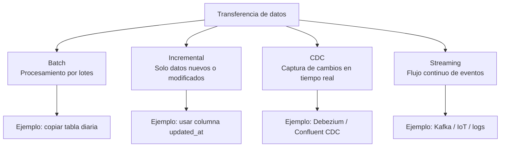
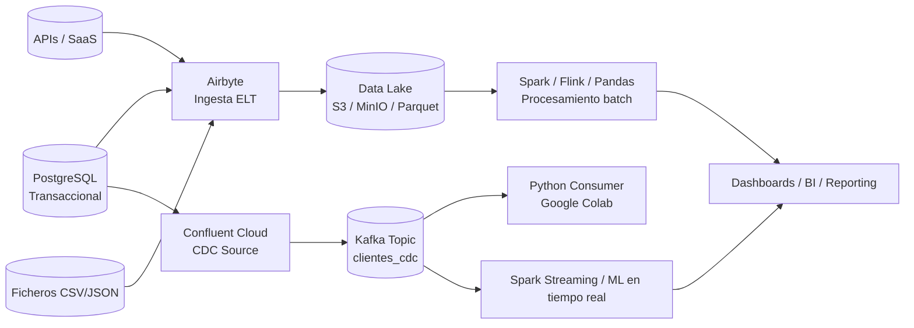

# Herramientas modernas de integración y transferencia de datos: Airbyte, Debezium y Kafka


# 📘 **Introducción a la integración y transferencia de datos en sistemas Big Data**

En cualquier sistema de Big Data, los datos no se encuentran de forma natural dentro del *data lake* o del sistema analítico: deben **llegar desde múltiples orígenes**, a menudo heterogéneos, distribuidos y con distintas velocidades de generación.
A este proceso global lo llamamos **integración y transferencia de datos**, y constituye una de las fases más críticas de toda arquitectura Big Data.

En este contexto, la ingesta y la integración son mucho más que mover ficheros:
implican garantizar que los datos que llegan al sistema son **completos, consistentes, actualizados y utilizables**.

---

## 🧩 1. ¿Qué significa *integrar* datos?

La **integración de datos** es el proceso mediante el cual combinamos, unificamos o reconciliamos datos procedentes de varias fuentes con el objetivo de obtener una visión coherente y homogénea.

Las fuentes pueden incluir:

* bases de datos transaccionales (OLTP)
* APIs REST
* archivos CSV, JSON, Parquet
* aplicaciones SaaS (CRM, ERP, analítica web…)
* sensores IoT o logs de sistemas

Integrar datos no significa únicamente copiarlos:
implica **alinear sus estructuras, formatos, significados y tiempos**, y prepararlos para análisis posterior.

### Objetivos clave de la integración:

* Unificar información fragmentada.
* Convertir datos heterogéneos en un formato común.
* Resolver inconsistencias y duplicados.
* Facilitar análisis posteriores (Spark, Pandas, ML…).
* Mantener una versión actualizada y coherente de los datos.

### Ejemplo:

Un sistema de ventas puede tener:

* datos transaccionales en PostgreSQL,
* catálogos de productos en un SaaS externo,
* analítica web en una API,
* datos de clientes en otra base de datos.

La integración permite unificarlos en una sola visión o modelo analítico.

---

## 🔄 2. ¿Qué significa *transferir* datos?

La **transferencia de datos** consiste en mover los datos desde su ubicación original hasta un lugar donde puedan almacenarse y procesarse (normalmente un *data lake*, un *warehouse* o un motor de streaming).

Esta transferencia puede adoptar varias modalidades:

### **A) Batch**

* Los datos se copian por lotes (cada noche, cada hora…).
* Adecuado cuando el tiempo real no es necesario.
* Ejemplo: exportar cada día la tabla de ventas.

### **B) Incremental**

* Solo se transfieren los registros nuevos o modificados desde la última sincronización.
* Reduce costes y volumen de datos.
* Ejemplo: columnas `updated_at` o `created_at`.

### **C) CDC (Change Data Capture)**

* Se capturan los cambios en tiempo real desde los logs internos de la BD.
* Refleja **insert, update, delete** sin recargar la tabla completa.
* Ideal para sincronización continua.

### **D) Streaming**

* Flujo constante de datos: logs, métricas, eventos, IoT, clics…
* Requiere una plataforma capaz de manejar grandes volúmenes en tiempo real.

---

## 🌐 3. ¿Cómo encajan la integración y la transferencia en una arquitectura Big Data?

En un sistema moderno de Big Data, el flujo general suele ser:

```
      Origen de datos
 (BD, API, SaaS, ficheros, IoT)
             │
             ▼
     Transferencia / Ingesta
 (batch, incremental, CDC, streaming)
             │
             ▼
       Data Lake / S3
   (raw → staged → curated)
             │
             ▼
       Procesamiento
 (Spark, Flink, Pandas, ML)
             │
             ▼
        Consumo analítico
    (dashboards, modelos, apps)
```

La **integración** garantiza la coherencia de los datos.
La **transferencia** garantiza que los datos llegan al lugar adecuado en el momento adecuado.

Ambas conforman el **pipeline de datos** que es la base de toda arquitectura Big Data moderna.

---

## ⚙️ 4. ¿Qué retos existen en la integración y transferencia?

1. **Heterogeneidad de formatos**

   * SQL, CSV, JSON, APIs REST, logs, binarios…

2. **Velocidades distintas**

   * Algunos orígenes generan datos a diario, otros cada segundo.

3. **Volumen elevado**

   * Transferir millones de filas requiere herramientas escalables.

4. **Consistencia y calidad**

   * Evitar duplicados, inconsistencias temporales o registros corruptos.

5. **Trazabilidad y auditoría**

   * Es fundamental saber *cuándo* y *cómo* se movieron los datos.

6. **Seguridad y privacidad**

   * Especialmente relevante en datos personales (RGPD).

---

## 💡 5. ¿Por qué necesitamos herramientas específicas?

Si bien en los primeros años del Big Data se usaban herramientas propias del ecosistema Hadoop (Sqoop, Flume), el panorama tecnológico ha evolucionado. Hoy se utilizan plataformas más modernas que:

* funcionan tanto en on-premise como en cloud,
* permiten conectores declarativos,
* soportan CDC y streaming,
* son fáciles de monitorizar y operar,
* siguen patrones ELT modernos.

Por eso trabajamos con:

* **Airbyte** para ingesta batch e incremental,
* **Debezium/CDC (vía Confluent)** para cambios en tiempo real,
* **Kafka** para flujos de eventos y streaming.

---
Perfecto.
Aquí tienes **tres diagramas Mermaid** que puedes usar en la sección "Integración y transferencia de datos".
Puedes usar uno solo o varios según dónde quieras insertarlos.

Incluyo:

1. **Diagrama general del flujo de integración y transferencia**
2. **Diagrama comparativo de modos de transferencia (batch / incremental / CDC / streaming)**
3. **Diagrama completo del pipeline moderno (Airbyte + CDC + Kafka + Data Lake)**

Todos en sintaxis lista para copiar en Markdown.

---

# 🎨 **1. Diagrama general — Integración y transferencia de datos**

```mermaid
flowchart LR
    A[Fuentes de datos<br/>(BD, APIs, SaaS, CSV, IoT)] --> B[Ingesta y transferencia<br/>(Batch, Incremental, CDC, Streaming)]
    B --> C[Data Lake / Almacenamiento<br/>(RAW / STAGED / CURATED)]
    C --> D[Procesamiento<br/>(Spark, Flink, Pandas, ML)]
    D --> E[Consumo analítico<br/>(Dashboards, Informes, Modelos)]
```

---

# 🔄 **2. Modos de transferencia — Diagrama comparativo**



---

# 🧩 **3. Pipeline moderno completo — Airbyte + CDC + Kafka + Data Lake**

Este es perfecto para situar a los alumnos antes de la práctica.



---

# ✔️ ¿Quieres que lo integre directamente en la sección de teoría dentro del documento 005?


## 6. Introducción a las herramientas de integración de datos moderna

En los primeros sistemas Big Data basados en Hadoop eran habituales herramientas como **Sqoop** y **Flume** para mover datos entre bases de datos relacionales, HDFS y sistemas de logs. Sin embargo, estos proyectos han quedado prácticamente **obsoletos** y han sido sustituidos por soluciones más flexibles, pensadas para la nube y para arquitecturas *streaming*.

En la práctica actual, la integración de datos se apoya en tres grandes piezas:

- **Airbyte**: integración de datos (*ELT*) entre orígenes (APIs, ficheros, bases de datos, SaaS) y destinos (data lakes, data warehouses, bases analíticas).
- **Debezium**: captura de cambios en bases de datos relacionales (**CDC, Change Data Capture**) en tiempo (casi) real.
- **Kafka + Kafka Connect**: plataforma de *streaming* y eventos que permite recibir, distribuir y persistir flujos de datos de alta velocidad.

El objetivo de esta sección es entender **qué hace cada herramienta**, **en qué casos usarla** y ver **ejemplos simples** que puedan servir de base para las prácticas de la unidad.

---

## 7. Airbyte: integración ELT sin código

### 7.1. ¿Qué es Airbyte?

**Airbyte** es una plataforma de integración de datos (*data integration*) que permite mover datos desde muy diversos orígenes hasta un destino, utilizando conectores ya preparados. Se puede usar en dos modalidades:

- **Airbyte OSS**: versión *open-source* que se despliega en local o en un servidor (por ejemplo, con Docker).
- **Airbyte Cloud**: servicio gestionado en la nube, donde el proveedor se encarga de la infraestructura.

En ambos casos, la idea es la misma:

> Configurar *sources* (orígenes) y *destinations* (destinos), definir qué datos se quieren copiar y con qué frecuencia, y dejar que Airbyte se encargue del resto.

### 7.2. Componentes básicos

- **Source (origen)**: de dónde vienen los datos. Ej.: PostgreSQL, MySQL, API REST, fichero CSV en S3, Google Sheets…
- **Destination (destino)**: dónde se escriben los datos. Ej.: MinIO/S3, BigQuery, Snowflake, PostgreSQL, data warehouse…
- **Connection (conexión)**: une un source con un destino y define:
  - qué tablas/streams se copian,
  - el modo de sincronización (completo, incremental),
  - la frecuencia (manual, cada X horas, cron…).

### 7.3. Caso de uso típico

Imaginemos un sistema transaccional en PostgreSQL con una tabla `ventas`. Queremos copiarla periódicamente a un *data lake* en formato Parquet:

- **Source**: conector PostgreSQL.
- **Destination**: conector S3/MinIO en modo Parquet.
- **Connection**: sincronización incremental diaria.

### 2.4. Ejemplo de configuración simplificada

Airbyte se configura normalmente desde la interfaz web, pero conceptualmente podríamos representarlo así:

```json
{
  "source": {
    "type": "postgres",
    "host": "db.internal",
    "port": 5432,
    "database": "ventas_db",
    "username": "airbyte",
    "password": "********"
  },
  "destination": {
    "type": "s3",
    "endpoint": "https://minio.ejemplo.local",
    "bucket_name": "datalake",
    "path_prefix": "raw/ventas/",
    "format": "parquet"
  },
  "sync": {
    "mode": "incremental",
    "cursor_field": "updated_at",
    "primary_key": ["id"],
    "schedule": "0 2 * * *"
  }
}
```

> No es necesario escribir JSON: usaremos  la interfaz web, pero este ejemplo ayuda a entender qué parámetros hay «debajo».

---

## 3. Debezium: captura de cambios en bases de datos (CDC)

### 3.1. ¿Qué es CDC?

Cuando trabajamos con bases de datos relacionales en producción (ERP, CRM, aplicaciones web, etc.), no basta con copiar la tabla completa de vez en cuando. Queremos:

* saber **qué filas se han insertado**,
* **qué filas se han actualizado**,
* **qué filas se han borrado**,

y hacerlo en tiempo (casi) real, sin lanzar consultas pesadas o bloquear la base de datos.

A esto se le llama **Change Data Capture (CDC)**.

### 3.2. ¿Qué hace Debezium?

**Debezium** es una plataforma *open-source* diseñada para CDC. En lugar de leer las tablas directamente, se conecta a los **logs internos** de la base de datos (binlog, WAL, etc.) y convierte cada cambio en un evento:

* inserción → evento «create»
* actualización → evento «update»
* borrado → evento «delete»

Normalmente Debezium se despliega junto a **Kafka Connect**, de forma que:

1. La base de datos genera sus logs internos de siempre (no hace falta modificar la aplicación).
2. Debezium lee esos logs y los envía a Kafka.
3. Cada tabla monitorizada se convierte en un *topic* de Kafka donde van llegando los cambios.

### 3.3. Ejemplo conceptual

Supongamos una tabla `pedidos` en PostgreSQL:

```sql
CREATE TABLE pedidos (
  id          SERIAL PRIMARY KEY,
  cliente_id  INTEGER NOT NULL,
  fecha       TIMESTAMP NOT NULL DEFAULT NOW(),
  total       NUMERIC(10,2) NOT NULL
);
```

Con Debezium configurado sobre esta base de datos:

* Cuando se inserta un nuevo pedido, aparece un mensaje en el *topic* `dbserver1.public.pedidos`.
* Cuando se actualiza un pedido (por ejemplo, cambia el `total`), se publica otro mensaje con **antes y después** de la fila.
* Lo mismo para las eliminaciones.

Estos mensajes pueden consumirse después desde Spark, Flink u otra herramienta para actualizar vistas analíticas, dashboards, etc.

Un ejemplo simplificado de mensaje (en formato JSON abreviado) podría ser:

```json
{
  "op": "u",
  "before": {"id": 10, "total": 50.00},
  "after":  {"id": 10, "total": 60.00},
  "ts_ms": 1731500000000
}
```

---

## 4. Kafka y Kafka Connect: *streaming* de eventos

### 4.1. Kafka como «bus de datos» en tiempo real

**Apache Kafka** es una plataforma de *streaming* distribuida que permite:

* Recibir datos (*producers*).
* Almacenarlos de forma distribuida (en *topics*).
* Servirlos a múltiples consumidores (*consumers*) en paralelo.

Se utiliza para:

* Logs de aplicaciones,
* eventos de usuarios (clics, navegación),
* métricas de sistemas,
* integraciones entre microservicios,
* y como «tubería» central donde Debezium y otras herramientas envían sus datos.

### 4.2. Conceptos básicos

* **Topic**: «canal» donde se publican mensajes (por ejemplo, `ventas`, `logs_servidor`).
* **Partition**: subdivisión de un topic para paralelizar la lectura/escritura.
* **Producer**: servicio que envía mensajes a un topic.
* **Consumer**: servicio que lee mensajes de un topic.
* **Broker**: servidor Kafka que almacena y sirve los datos.

### 4.3. Kafka Connect

**Kafka Connect** es un componente de Kafka que simplifica la tarea de:

* leer datos de una fuente externa → topic Kafka (conectores *source*),
* enviar datos desde un topic Kafka → sistema externo (conectores *sink*).

Ejemplos de conectores *sink* habituales:

* sink a S3 / MinIO (para *data lake*),
* sink a Elasticsearch / OpenSearch (para búsqueda y dashboards),
* sink a bases SQL de apoyo (para vistas materializadas).
---
# 📘 **5. Introudcción a MinIO**

**MinIO** es una alternativa *open-source* y ligera al servicio Amazon S3.

Implementa la API oficial de S3, por lo que herramientas como Airbyte, Spark, Kafka Connect o Python pueden trabajar con MinIO exactamente igual que si fuera AWS S3.

### ¿Para qué lo usamos en Big Data?

-   Para simular un **data lake** (zona RAW / STAGED / CURATED).
-   Para almacenar **ficheros Parquet**, **CSV**, **JSON**, logs…
-   Para probar pipelines sin necesidad de usar AWS.

### ¿Por qué lo usamos en clase?

-   No requiere cuenta cloud.
-   Es muy ligero (solo un contenedor Docker).
-   Compatible con los conectores modernos.

------------------------------------------------------------------------

# 📘 **6. ¿Qué es Zookeeper?**

Tradicionalmente, Kafka dependía de un sistema externo llamado **Zookeeper**, cuyo cometido es:

-   Mantener información de estado de los brokers Kafka
-   Coordinar controladores en el cluster
-   Elegir líderes para particiones
-   Almacenar metadatos de configuración

**HOY:** Kafka moderno incluye un modo llamado *KIP-500* que elimina Zookeeper, pero muchas distribuciones de Debezium y Kafka Connect **todavía usan la arquitectura clásica**.

### ¿Por qué aparece en nuestra práctica?

Porque Debezium + Kafka Connect dependen de la arquitectura tradicional de Kafka, donde Zookeeper es obligatorio. Es importante conocerlo al menos a nivel conceptual.
---

## 7. Ejemplos didácticos

### 5.1. Ejemplo simple de productor Kafka en Python

Suponiendo que tenemos un broker Kafka accesible (local o en la nube), podemos enviar mensajes desde Python usando `kafka-python` o `confluent-kafka`. Ejemplo simplificado:

```python
from kafka import KafkaProducer
import json
from datetime import datetime

producer = KafkaProducer(
    bootstrap_servers="localhost:9092",
    value_serializer=lambda v: json.dumps(v).encode("utf-8")
)

evento = {
    "cliente_id": 123,
    "producto_id": 45,
    "cantidad": 2,
    "timestamp": datetime.utcnow().isoformat()
}

producer.send("ventas", value=evento)
producer.flush()
```

Este código envía un mensaje JSON al topic `ventas`. En una práctica, otro script (o un notebook) podría leer estos eventos y contarlos, agruparlos, etc.

### 5.2. Esquema de integración completo

Un flujo moderno de integración podría ser:

1. **Airbyte** copia tablas «lentas» (maestros, catálogos) desde PostgreSQL a S3.
2. **Debezium** captura los cambios en las tablas transaccionales (pedidos, pagos) y los envía a Kafka.
3. **Kafka Connect** vuelca esos eventos a otra base de datos o a un *data lake* en tiempo real.
4. **Spark** o **Flink** consumen los datos de Kafka para construir vistas analíticas o modelos de ML.

Gráficamente:

```text
PostgreSQL  ──(Airbyte batch)──▶  S3 (data lake)
      │
      └─(Debezium CDC)──▶ Kafka ──(Connect sink)──▶ S3 / DW / Elastic
```

---

## 8. Actividad práctica: *pipelines* con Airbyte, Debezium y Kafka

Al final de la unidad, se propone una actividad integradora donde el alumnado diseñará un pequeño ecosistema moderno de integración de datos. La actividad tiene dos variantes para adaptarse a las capacidades de los equipos:

* **Variante A (local con Docker)**: para quienes dispongan de hardware suficiente (mínimo 8 GB RAM recomendados).
* **Variante B (cloud / servicios gestionados)**: para quienes tengan hardware limitado.

### 6.1. Objetivo de la actividad

Diseñar y documentar un *pipeline* de datos que combine al menos **dos** de estas piezas:

* Airbyte para ingesta *batch* o incremental,
* Debezium para captura de cambios (CDC),
* Kafka + *consumer* para procesar o visualizar los eventos.

No es necesario desplegar todo el ecosistema completo, pero sí ver en funcionamiento:

* una ingesta periódica o incremental con Airbyte, o
* un flujo de cambios (CDC) que llegue hasta Kafka, o
* un pequeño flujo de eventos simulados desde un *producer* Python a Kafka.

### 6.2. Variante A: entorno local (Docker Compose)

Para el que tenga equipo suficientes, se facilitar (o completar en clase) un `docker-compose.yml` con servicios como:

* `zookeeper` + `kafka` (o un Kafka moderno sin Zookeeper),
* `postgres` (como base de datos de ejemplo),
* `debezium` (conector de CDC),
* `airbyte` (opcional),
* `minio` (para simular S3).

El trabajo consistirá en:

1. Levantar los contenedores.
2. Configurar una conexión de Airbyte (ej.: PostgreSQL → MinIO).
3. Configurar un conector Debezium que envíe cambios de una tabla a Kafka.
4. Escribir un pequeño script Python que lea mensajes del topic y los muestre por pantalla o los escriba en un fichero.

### 6.3. Variante B: entorno *cloud* (sin instalaciones locales pesadas)

Para el alumnado sin capacidad de cómputo suficiente, se puede plantear una alternativa apoyada en cuentas gratuitas o de estudiante (según disponibilidad del centro y del curso):

* Uso de **Airbyte Cloud** o instancia desplegada en la nube, accesible desde el navegador.
* Uso de un **cluster Kafka gestionado** (por ejemplo, un servicio con plan gratuito o un cluster preparado ) donde:

  * ya existan credenciales,
  * y solo haya que conectarse con un *producer/consumer* ligero (Python) desde su equipo o desde un notebook en la nube (Google Colab, por ejemplo).

En este caso, las tareas serían:

1. Acceder a la interfaz *cloud* de Airbyte (o similar) y revisar/construir una conexión ejemplo (aunque no puedan administrar el servidor).
2. Usar un cuaderno de Python en la nube (Colab) que se conecta al Kafka gestionado (con credenciales proporcionadas) para:

   * enviar algunos eventos de ejemplo,
   * consumirlos y mostrarlos en un gráfico o tabla simple.

### 6.4. Entregables comunes

Independientemente de la variante elegida, se entregará:

* Un **diagrama del flujo de datos** (puede ser dibujado con una herramienta sencilla o en Markdown usando texto).
* Un breve **informe técnico** (1–2 páginas) que explique:

  * qué herramienta se ha usado para qué,
  * qué datos se mueven y con qué frecuencia,
  * qué problemas se han encontrado y cómo se han resuelto.
* Fragmentos de **configuración o código** utilizados (scripts Python, extractos de configuración, etc.).
* Capturas de pantalla clave del pipeline en funcionamiento (Airbyte, Debezium, panel de Kafka, notebooks… cuando sea posible).

Opcionalmente, se puede añadir para esta actividad al final de la unidad:

* diseño del pipeline,
* correcta configuración de las herramientas,
* documentación y claridad de la explicación,
* reflexión sobre ventajas/inconvenientes de la arquitectura elegida.


